# 企业级通用 ACL 管理系统

一个面向企业场景的、可配置、可治理、可回放的通用 ACL（Access Control List）管理系统。

本项目不是单纯的 RBAC 角色列表工具，而是围绕 `Subject + Object + Action + Relation + Context + Lifecycle` 六元组构建的权限治理平台，目标是在统一 TypeScript Monorepo 中同时覆盖：

1. 权限模型配置与校验
2. 发布门禁与复核工作流
3. 判权引擎与决策解释
4. 关系驱动的上下文推导
5. 生命周期事件处理
6. 控制台可视化与运行态维护

当前仓库已经具备 Phase 1 / MVP 级别的工程骨架与核心能力，可直接启动 API、控制台，并跑通发布、模拟、判权、关系维护与回放流程。

## 为什么是这个项目

企业权限问题通常不是“给角色分配权限”这么简单，常见需求往往依赖关系、上下文和生命周期：

1. 同部门可读，跨部门不可读
2. 虚拟项目组成员可见，负责人可变更
3. 高敏感对象只允许在窗口期执行高风险动作
4. owner 可以管理自己名下对象
5. 主体离岗、组织调整、关系删除后，权限要自动收敛

因此，本项目选择的是“关系驱动 + 配置驱动 + 治理闭环”的 ACL 方案，而不是仅做静态角色映射。

## 核心能力

1. 模型层：支持主体、客体、动作、关系、上下文、生命周期统一建模
2. 校验层：支持 JSON Schema、语义、安全、可执行性等多层校验
3. 门禁层：支持 `P0 / P1 / P2 / P3` 分级发布门禁
4. 决策层：支持四值决策、规则 trace、合并算法
5. 关系层：支持主体关系、客体关系、主体-客体关系与上下文推导
6. 生命周期：支持基于事件的关系收敛与治理动作
7. 控制面：支持对象台账、关系事件、模型路由、发布请求、模拟报告维护
8. 控制台：支持发布流程、影响模拟、关系回放、控制面维护、组件展示

## 系统全景

```mermaid
%%{init: {'theme':'base', 'themeVariables': { 'background':'#ffffff','primaryColor':'#f4f4f4','primaryTextColor':'#161616','primaryBorderColor':'#8d8d8d','lineColor':'#6f6f6f','secondaryColor':'#edf5ff','tertiaryColor':'#fff2e8','mainBkg':'#f4f4f4','secondBkg':'#edf5ff','tertiaryBkg':'#fff2e8','textColor':'#161616'}}}%%
flowchart LR
    A[权限模型配置] --> B[Schema 与语义校验]
    B --> C[P0-P3 发布门禁]
    C -->|通过/复核通过| D[发布激活与模型路由]
    D --> E[运行态控制面数据]
    E --> F[判权评估与搜索]
    F --> G[决策回放 / 审计 / 生命周期处理]
    H[控制台] --> A
    H --> C
    H --> E
    H --> G

    classDef entry fill:#edf5ff,stroke:#0043ce,color:#161616,stroke-width:1.6px;
    classDef process fill:#f4f4f4,stroke:#8d8d8d,color:#161616,stroke-width:1.2px;
    classDef decision fill:#fff2e8,stroke:#ff832b,color:#161616,stroke-width:1.5px;
    classDef result fill:#d9fbfb,stroke:#007d79,color:#161616,stroke-width:1.5px;
    classDef highlight fill:#e8daff,stroke:#6929c4,color:#161616,stroke-width:1.4px;

    class H entry;
    class A,B,E,F process;
    class C decision;
    class D highlight;
    class G result;
    linkStyle default stroke:#6f6f6f,stroke-width:1.3px;
```



## 技术栈

项目采用统一 TypeScript 全栈路线：

1. Monorepo：`pnpm workspace` + `turbo`
2. Backend API：Node.js 20+ + Fastify
3. Frontend Console：Node 渲染控制台 + TypeScript
4. 配置校验：JSON Schema Draft 2020-12 + `ajv`
5. 类型共享：共享领域类型包
6. 测试：`vitest`
7. 持久化：内存存储 / PostgreSQL 适配器

## 仓库结构

```text
.
├── apps/
│   ├── api/                   # 控制面与判权 API
│   └── console/               # ACL 控制台
├── packages/
│   ├── shared-types/          # 共享领域类型与示例模型
│   ├── schema/                # JSON Schema 与结构校验
│   ├── policy-dsl/            # 策略选择器 DSL 解析
│   ├── validator/             # 多层模型校验器
│   ├── engine/                # PDP 判权决策引擎
│   ├── constraints/           # SoD / Cardinality 约束求值
│   ├── lifecycle/             # 生命周期事件处理
│   ├── gate/                  # 发布门禁执行器
│   └── persistence/           # 内存 / PostgreSQL 持久化适配
└── docs/                      # 设计、规范、样例与用户文档
```

## 当前实现状态

当前仓库已经落地的能力包括：

| 模块 | 当前状态 | 说明 |
| --- | --- | --- |
| `@acl/shared-types` | 已实现 | 领域类型、示例模型、配置结构 |
| `@acl/schema` | 已实现 | JSON Schema 校验与错误输出 |
| `@acl/policy-dsl` | 已实现 | 选择器 DSL 解析 |
| `@acl/validator` | 已实现 | 多层校验总装配 |
| `@acl/engine` | 已实现 | 四值决策、规则求值、trace |
| `@acl/constraints` | 已实现 | `SoD` 与 `Cardinality` 约束检查 |
| `@acl/gate` | 已实现 | `baseline` / `strict_compliance` 门禁执行 |
| `@acl/lifecycle` | 已实现 | `subject_removed` 等生命周期处理 |
| `@acl/persistence` | 已实现 | `memory` / `postgres` 适配 |
| `apps/api` | 已实现 | 发布、模拟、判权、控制面、回放 API |
| `apps/console` | 已实现 | 发布流程、控制面维护、模拟与回放控制台 |

## 快速开始

### 1. 环境要求

1. Node.js `20+`
2. `corepack`
3. 可选：PostgreSQL（如果你希望使用持久化存储）

注意：项目约定使用 `corepack pnpm`，不要依赖系统全局 `pnpm`。

### 2. 安装依赖

```bash
corepack enable
corepack pnpm install
```

### 3. 启动开发环境

推荐直接使用仓库自带脚本，一次启动 API 和控制台：

```bash
corepack pnpm dev:start
```

默认访问地址：

1. Console: `http://127.0.0.1:3020`
2. API: `http://127.0.0.1:3010`
3. Health Check: `http://127.0.0.1:3010/healthz`

如果你想分别启动：

```bash
corepack pnpm --filter @acl/api dev
corepack pnpm --filter @acl/console dev
```

### 4. 常用命令

```bash
corepack pnpm build
corepack pnpm typecheck
corepack pnpm test
```

## 环境变量

### 通用

| 变量名 | 默认值 | 说明 |
| --- | --- | --- |
| `ACL_API_PORT` | `3010` | API 监听端口 |
| `ACL_CONSOLE_PORT` | `3020` | 控制台监听端口 |
| `ACL_API_BASE_URL` | `http://127.0.0.1:3010` | 控制台访问 API 的地址 |

### 控制面访问控制

除 `healthz`、`/decisions:evaluate`、`/decisions/search` 等运行态入口外，绝大多数控制面与回放接口默认都要求控制面 Token。

| 变量名 | 默认值 | 说明 |
| --- | --- | --- |
| `ACL_CONTROL_TOKEN` | `dev:start` 脚本内置默认值 | 控制面访问 Token，支持 `X-ACL-Token` 或 `Authorization: Bearer` |
| `ACL_CONTROL_IP_ALLOWLIST` | 空 | 控制面 IP 白名单，支持逗号分隔 IP 或 IPv4 CIDR |

如果你不使用 `dev:start`，请显式传入 `ACL_CONTROL_TOKEN`，否则控制面接口会返回 `403`。

### 持久化

| 变量名 | 默认值 | 说明 |
| --- | --- | --- |
| `ACL_PERSISTENCE_DRIVER` | `memory` | 持久化驱动，支持 `memory` / `postgres` |
| `ACL_POSTGRES_DSN` | 空 | PostgreSQL 连接串；配置后可自动切到 `postgres` |

`memory` 模式适合本地开发和演示，进程重启后数据不会保留。

### PostgreSQL 初始化说明

仓库已经提供 PostgreSQL 初始化脚本和 SQL migration：

1. `packages/persistence/scripts/postgres/init-acl-db.mjs`
2. `packages/persistence/scripts/postgres/migrations/`

如果你计划启用 PostgreSQL，建议先审阅这些 SQL，再手动执行初始化。项目协作约束下，不应在未确认的情况下自动变更数据库 schema。

## 典型使用路径

建议按下面的顺序理解和使用系统：

1. 准备模型：定义主体、客体、动作、关系、规则、生命周期与质量门禁
2. 校验模型：执行结构与语义校验
3. 提交发布：触发 `P0-P3` 门禁
4. 影响模拟：查看本次变更会影响哪些主体、客体、动作
5. 人工复核：当 `P1/P2` 命中时进入复核
6. 激活发布：将已批准的发布切换为正式生效版本
7. 配置路由：将 `namespace + tenant + environment` 路由到已发布模型
8. 维护运行态：导入对象、关系、审计与命名空间数据
9. 在线判权：调用 `/decisions:evaluate` 或 `/decisions/search`
10. 回放与排查：查看 `decision`、`publish`、`simulation`、`lifecycle` 结果

## API 概览

### 运行态接口

这些接口适合接入判权链路或联调：

| 方法 | 路径 | 说明 |
| --- | --- | --- |
| `GET` | `/healthz` | 服务健康检查 |
| `POST` | `/decisions:evaluate` | 单次判权评估 |
| `POST` | `/decisions/search` | 基于条件搜索可访问对象 |

### 控制面与治理接口

这些接口默认需要 `ACL_CONTROL_TOKEN`：

| 分类 | 代表接口 | 说明 |
| --- | --- | --- |
| 模型校验 | `/selectors:parse`, `/models:validate`, `/objects:onboard-check` | 结构、语义、入管检查 |
| 发布流程 | `/publish:gate-check`, `/publish:simulate`, `/publish/submit`, `/publish/review`, `/publish/activate` | 发布与模拟工作流 |
| 发布回放 | `/publish/requests`, `/gate-reports/:id`, `/publish/simulations/:id` | 发布详情与门禁报告 |
| 控制面维护 | `/control/objects*`, `/control/relations*`, `/control/model-routes*`, `/control/audits`, `/control/namespaces` | 对象、关系、路由与审计维护 |
| 生命周期 | `/lifecycle:subject-removed`, `/lifecycle-reports/:id` | 生命周期事件执行与回放 |
| 决策回放 | `/decisions`, `/decisions/:id` | 决策记录查询 |

## 一个最小联调示例

### 健康检查

```bash
curl http://127.0.0.1:3010/healthz
```

### 判权示例

下面示例演示直接携带模型进行一次判权请求：

```bash
curl -X POST http://127.0.0.1:3010/decisions:evaluate \
  -H 'content-type: application/json' \
  -d '{
    "model": {
      "model_meta": {
        "model_id": "demo_acl_v1",
        "tenant_id": "tenant_demo",
        "version": "2026.03.16",
        "status": "draft",
        "combining_algorithm": "deny-overrides"
      },
      "catalogs": {
        "action_catalog": ["read"],
        "subject_type_catalog": ["user"],
        "object_type_catalog": ["kb"],
        "subject_relation_type_catalog": [],
        "object_relation_type_catalog": [],
        "subject_object_relation_type_catalog": []
      },
      "relation_signature": {
        "subject_relations": [],
        "object_relations": [],
        "subject_object_relations": []
      },
      "object_onboarding": {
        "compatibility_mode": "compat_open",
        "default_profile": "minimal",
        "profiles": {
          "minimal": {
            "required_fields": ["tenant_id", "object_id", "object_type", "created_by"]
          }
        },
        "conditional_required": []
      },
      "policies": {
        "rules": [
          {
            "id": "allow_read_same_department",
            "subject_selector": "subject.type == user and context.same_department == true",
            "object_selector": "object.type == kb",
            "action_set": ["read"],
            "effect": "allow",
            "priority": 100
          }
        ]
      },
      "constraints": {
        "sod_rules": [],
        "cardinality_rules": []
      },
      "lifecycle": {
        "event_rules": []
      },
      "consistency": {
        "default_level": "bounded_staleness",
        "high_risk_level": "strong",
        "bounded_staleness_ms": 3000
      },
      "quality_guardrails": {
        "attribute_quality": {
          "authority_whitelist": ["hr_system"]
        },
        "mandatory_obligations": []
      }
    },
    "input": {
      "action": "read",
      "subject": {
        "id": "user:alice",
        "type": "user"
      },
      "object": {
        "id": "kb:finance",
        "type": "kb",
        "sensitivity": "normal"
      },
      "context": {
        "same_department": true
      }
    },
    "options": {
      "strict_validation": false
    }
  }'
```

## 配置模型一览

README 只给总览，完整设计以文档为准。一个完整模型通常包含以下部分：

1. `model_meta`：模型元信息、租户、版本、合并算法
2. `catalogs`：动作、主体类型、客体类型、关系类型目录
3. `action_signature`：动作类型签名白名单
4. `relation_signature`：关系类型签名白名单
5. `object_onboarding`：客体入管兼容模式、Profile、条件必填
6. `context_inference`：基于关系图的上下文推导规则
7. `decision_search`：搜索推导与 pushdown 策略
8. `policies`：策略规则
9. `constraints`：`SoD` 与 `Cardinality`
10. `lifecycle`：生命周期事件与处理器
11. `consistency`：一致性等级与高风险域要求
12. `quality_guardrails`：属性质量与强制 obligations

## 控制台说明

控制台默认启动在 `http://127.0.0.1:3020`，当前包含以下主要标签页：

1. `workflow`：发布流程与发布请求详情
2. `simulation`：影响模拟报告与变化矩阵
3. `relations`：关系回放与排查
4. `control`：模型提交、对象维护、关系维护、模型路由
5. `system`：系统与运行态信息
6. `components`：组件索引与展示入口

控制台通过 `ACL_API_BASE_URL` 连接 API，并会自动携带 `ACL_CONTROL_TOKEN` 访问控制面接口。

## 测试与样例

你可以从以下位置快速了解当前实现与典型样例：

1. `apps/api/test/`：API 集成测试
2. `apps/api/test/fixtures/`：模型、setup、expected 夹具
3. `packages/*/test/`：各领域包单测
4. `packages/shared-types/src/examples.ts`：最小示例模型

## 文档导航

项目设计与实现说明建议按以下顺序阅读：

1. [docs/10_企业可配置权限模型开发设计.md](./docs/10_企业可配置权限模型开发设计.md)
2. [docs/11_权限配置JSON_Schema草案.md](./docs/11_权限配置JSON_Schema草案.md)
3. [docs/12_权限发布门禁规则样例.md](./docs/12_权限发布门禁规则样例.md)
4. [AGENTS.md](./AGENTS.md)

补充文档：

1. [docs/00_术语统一规范.md](./docs/00_术语统一规范.md)
2. [docs/14_企业ACL用户操作手册.md](./docs/14_企业ACL用户操作手册.md)
3. [docs/15_企业ACL建模与配置指南.md](./docs/15_企业ACL建模与配置指南.md)
4. [docs/17_第三方系统接入API_Reference.md](./docs/17_第三方系统接入API_Reference.md)
5. [docs/18_关系删除同步与一致性保障方案.md](./docs/18_关系删除同步与一致性保障方案.md)

## 设计优先级与当前兼容说明

仓库协作约定明确要求：

1. 设计解释以 `docs/10` 为最高优先级
2. 结构约束以 `docs/11` 为基础
3. 发布门禁以 `docs/12` 为门禁规则参考

当前代码中存在少量向后兼容实现，例如：

1. 某些测试夹具仍兼容历史 `relation_type_catalog` 写法
2. 当前示例模型中部分字段在代码路径里仍允许渐进收敛

README 以设计主线为准，同时尽量对齐当前仓库里的真实实现行为。

## 路线图

下一阶段建议继续完善：

1. 更完整的 Schema 与语义校验一致性收敛
2. 更丰富的生命周期事件处理器
3. 更成熟的控制台交互与可视化
4. 更完整的第三方接入与标准化 API
5. 更强的 PostgreSQL 生产化能力与观测能力

## 许可证

仓库当前未附带 `LICENSE` 文件。若准备公开发布到 GitHub，建议在发布前补充明确的许可证声明。
