# 企业可配置权限模型设计（完整设计稿）

> 文档编号：54  
> 更新日期：2026-03-04  
> 术语遵循 [00_术语统一规范](./00_术语统一规范.md)

## 1. 文档目标与边界

本文档目标是定义一个完整、可配置、可治理、可视化的企业权限模型，覆盖：

1. 权限问题的本质抽象。  
2. 可表达的数据模型。  
3. 动态关系与生命周期规则。  
4. 配置边界与代表性配置样例。  
5. 面向管理员的可视化管理形态。

本文档暂不展开：

1. 与现有系统的兼容与迁移步骤。  
2. 数据库 Schema、接口、缓存、任务编排等实现细节。  
3. 性能压测与工程上线方案。

## 2. 核心问题定义

企业权限管理本质是一个多关系约束系统，而不是“角色列表”系统。

核心六元组：

1. `Subject`：谁发起行为。  
2. `Object`：行为作用于什么对象。  
3. `Action`：允许或拒绝什么动作。  
4. `Relation`：主体之间、客体之间、主体与客体之间的关系。  
5. `Context`：何种上下文条件下生效。  
6. `Lifecycle`：当组织、关系、资产变化时，权限如何自动更新。

如果缺少生命周期语义，再严密的静态规则也会在组织变更后失真。

## 3. 总体元模型

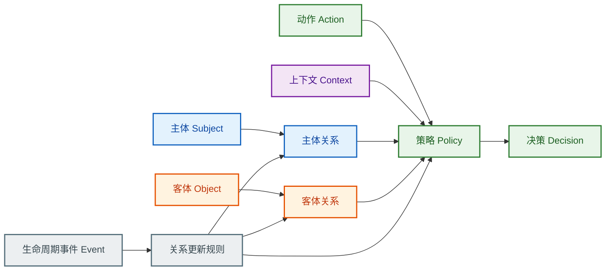

### 3.1 抽象数据单元

| 抽象单元 | 核心语义 | 最小属性集合 |
| --- | --- | --- |
| `SubjectNode` | 行为发起者或治理主体 | `id`、`type`、`state`、`labels` |
| `ObjectNode` | 被访问或被管理目标 | `id`、`type`、`sensitivity`、`owner_ref`、`labels` |
| `RelationEdge` | 节点之间关系边 | `from`、`to`、`relation_type`、`scope`、`validity`、`source` |
| `ActionAtom` | 原子动作能力 | `action_id`、`action_domain`、`risk_level` |
| `PolicyRule` | 决策规则单元 | `subject_selector`、`object_selector`、`action_set`、`effect`、`conditions`、`priority`、`validity` |
| `DecisionRecord` | 决策可解释记录 | `request`、`matched_rules`、`overridden_rules`、`final_effect`、`reason` |
| `LifecycleEvent` | 触发关系更新的事件 | `event_type`、`target`、`occurred_at`、`operator` |

### 3.2 模型原则

1. 任一授权都能回到“节点 + 边 + 规则”的统一表达。  
2. 任一变更都能回到“事件驱动重算”的统一机制。  
3. 任一争议都能回放到“命中路径 + 裁决依据”。

## 4. Subject（主体）模型

### 4.1 主体类型

1. 自然人：员工、外包、合作方成员。  
2. 组织主体：部门、小组、项目组、虚拟协作组。  
3. 职责主体：岗位、值班角色、审批角色。  
4. 机器主体：服务账号、自动任务、智能体进程。  
5. 代理主体：被委派执行的身份。

### 4.2 主体关系分层

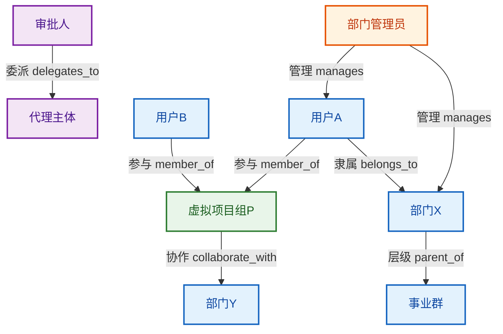

主体关系最小闭集建议包含：

1. 结构关系：`belongs_to`、`parent_of`。  
2. 虚拟关系：`member_of`、`collaborate_with`。  
3. 治理关系：`manages`、`can_grant`。  
4. 委派关系：`delegates_to`。

### 4.3 主体关系属性

1. `scope`：作用域（对象域、动作域）。  
2. `validity`：生效区间（开始、结束、是否临时）。  
3. `source`：来源（人配、审批、外部同步、自动规则）。  
4. `assurance`：关系可信级别。

## 5. Object（客体）模型

### 5.1 客体类型

1. 业务资产：知识库、智能体、工具、流程、服务。  
2. 治理资产：策略模板、审计记录、密钥配置。  
3. 组合资产：项目空间、资产包、集合视图。

### 5.2 客体关系类型

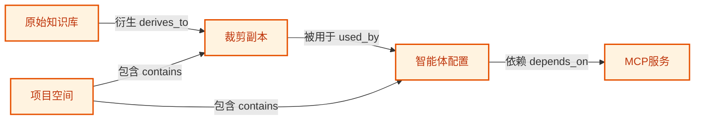

客体关系建议支持：

1. 层级：`contains / parent_of`。  
2. 衍生：`derives_to / cloned_from`。  
3. 依赖：`depends_on`。  
4. 归属：`owned_by`。  
5. 引用：`references`。

### 5.3 客体关系的权限影响

1. 层级关系决定父子授权传播。  
2. 衍生关系决定源约束是否继承。  
3. 依赖关系决定联动检查要求。  
4. 归属关系决定默认管理权起点。

### 5.4 客体入管契约（低摩擦原则）

为避免“必填太多导致难用”，客体入管采用分层必填模型，而不是单一大而全必填表。

`硬必填（最小集）` 仅包含：

1. `tenant_id`：租户边界。  
2. `object_id`：对象唯一标识。  
3. `object_type`：对象类型。  
4. `created_by`：创建发起主体。

说明：

1. `owner_ref` 缺省时可默认回填为 `created_by`。  
2. `sensitivity` 缺省时可按 `object_type` 默认值回填。  
3. 其余治理字段通过“动态必填”按模型配置决定。

### 5.5 动态必填机制（模型驱动）

客体创建时的最终必填集合由模型动态计算：

`RequiredFields(object) = HardRequired ∪ ProfileRequired ∪ ConditionalRequired`

其中：

1. `HardRequired`：平台统一硬必填（上节 4 项）。  
2. `ProfileRequired`：按客体入管配置档（Profile）决定。  
3. `ConditionalRequired`：按上下文条件追加（如高敏、外部来源、衍生对象）。

建议配置方式（示意）：

```yaml
object_onboarding:
  default_profile: "minimal"
  profiles:
    minimal:
      required_fields: [tenant_id, object_id, object_type, created_by]
      autofill:
        owner_ref: "created_by"
        sensitivity: "by_object_type_default"
    governance:
      required_fields: [tenant_id, object_id, object_type, created_by, owner_ref, sensitivity, org_scope]
      autofill:
        relation_anchor: "null"
  conditional_required:
    - when: "object.sensitivity == high"
      add_fields: [data_domain, retention_class]
    - when: "object.source == external"
      add_fields: [namespace, external_ref]
    - when: "object.is_derived == true"
      add_fields: [source_ref]
```

### 5.6 兼容与渐进收敛

为兼容存量对象和不同租户成熟度，入管校验支持三种模式：

1. `compat_open`：仅校验硬必填，缺失动态字段时允许入管并标记治理告警。  
2. `compat_balanced`：硬必填 + Profile 必填必须满足；条件必填可暂缓但需补录时限。  
3. `compat_strict`：硬必填 + Profile 必填 + 条件必填全部满足，否则拒绝入管。

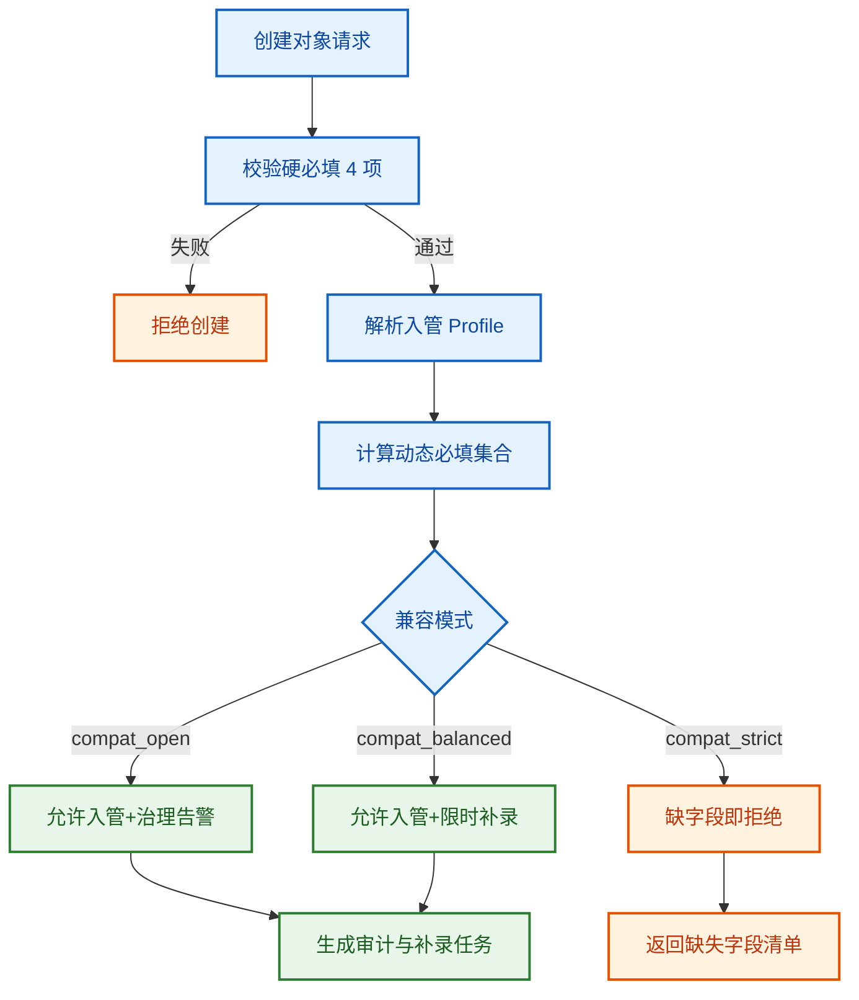

兼容性结论：

1. 该机制兼容“低门槛接入”（最小硬必填）。  
2. 该机制兼容“高治理要求”（动态必填按模型增强）。  
3. 该机制兼容“存量对象渐进收敛”（通过模式切换逐步收紧）。

## 6. Action（动作）模型

动作应采用分层模型：

1. `查看层`：可见、可读元信息、可读内容。  
2. `执行层`：调用、运行、触发。  
3. `变更层`：创建、编辑、删除、发布。  
4. `治理层`：授权、转授权、回收、审计查看。  
5. `委派层`：可否转交动作能力。

动作表达应同时支持：

1. 原子动作（精细控制）。  
2. 动作包（批量配置）。  
3. 动作约束（允许编辑但禁止删除）。

## 7. 策略与决策语义

### 7.1 统一策略表达

`Policy = <SubjectSelector, ObjectSelector, ActionSet, Effect, Conditions, Priority, Validity>`

字段语义：

1. `SubjectSelector`：主体选择器，可按关系路径选择。  
2. `ObjectSelector`：客体选择器，可按类型、标签、关系域选择。  
3. `ActionSet`：动作集合。  
4. `Effect`：`allow` 或 `deny`。  
5. `Conditions`：时间、地点、审批态、风险等级等条件。  
6. `Priority`：冲突排序。  
7. `Validity`：有效区间。

### 7.2 决策值语义（四值）

决策结果使用四值：

1. `allow`。  
2. `deny`。  
3. `not_applicable`（无策略匹配）。  
4. `indeterminate`（策略可匹配但上下文不足或求值失败）。

### 7.3 合并算法语义

多策略命中时采用显式合并算法，默认 `deny-overrides`。

可选算法：

1. `deny-overrides`。  
2. `permit-overrides`。  
3. `first-applicable`。  
4. `ordered-deny-overrides`。

### 7.4 obligations 与 advice

决策输出除了通过/拒绝，还需支持：

1. `obligations`：必须执行的后置动作（如审计写入、二次审批、脱敏）。  
2. `advice`：建议动作（如提示风险、建议缩小共享范围）。

## 8. 约束模型（SoD 与基数约束）

### 8.1 职责分离（SoD）

用于防止高风险动作由同一主体串联完成。

示例：

1. `policy_publish` 与 `policy_approve` 不可由同一主体同时执行。  
2. `approve_payment` 与 `execute_payment` 不可由同一主体同时执行。

### 8.2 基数约束（Cardinality）

用于限制关键角色或关键关系数量。

示例：

1. 租户 `root` 角色上限 2 人。  
2. 超级管理员上限 3 人。  
3. 高敏资产可授权管理者上限 N 人。

## 9. 动态关系与生命周期规则

### 9.1 生命周期事件类型

1. 主体事件：入职、离职、禁用、转岗、组织迁移、并组、拆组。  
2. 客体事件：创建、归档、删除、复制、衍生、归属转移。  
3. 关系事件：建立关系、解除关系、委派开始、委派到期。  
4. 策略事件：发布、停用、覆盖、回滚。

### 9.2 主体移除默认语义（核心）

当 `subject` 被移除时，默认更新规则：

1. `直接关系撤销`：该主体作为端点的显式关系立即失效。  
2. `继承能力收敛`：通过该主体获得的继承权限立即重算。  
3. `委派关系终止`：以该主体为源或目标的委派立即终止。  
4. `管理职责接管`：若出现唯一管理员空缺，资产进入待接管队列。  
5. `资产归属重算`：该主体名下资产进入“预设接管主体”或“待接管状态”。  
6. `审计链冻结`：历史决策链可回放，不因主体移除而丢失。

### 9.3 生命周期处理流程

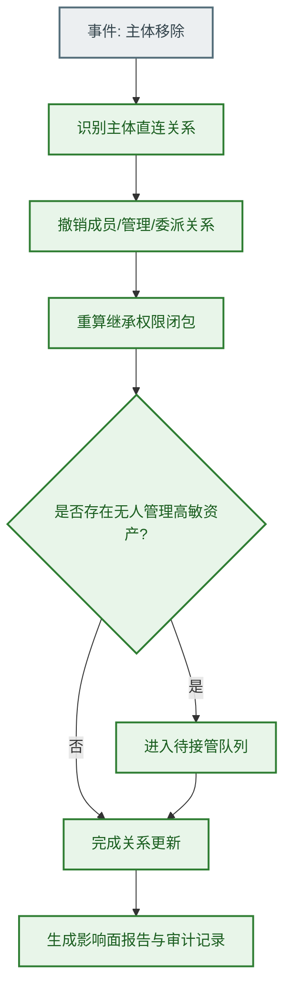

### 9.4 生命周期一致性约束

1. 不出现悬空主体或悬空客体引用。  
2. 不出现不可解释的隐式权限。  
3. 不长期存在无人管理的高敏资产。  
4. 历史决策可追溯、可回放。

## 10. 冲突裁决与一致性语义

### 10.1 冲突裁决优先级

默认裁决顺序：

1. 强制安全边界优先（租户隔离、主体失效、法定约束）。  
2. 显式 `deny` 高于显式 `allow`。  
3. 更具体策略高于通配策略。  
4. 临时策略（有效期内）高于长期默认策略。  
5. 同级策略按发布时间或版本序裁决。

### 10.2 一致性级别

鉴权读取可声明一致性级别：

1. `strong`：高敏写操作与高敏读取。  
2. `bounded_staleness`：常规列表与检索场景。  
3. `eventual`：低风险、可容忍短暂陈旧场景。

### 10.3 属性质量语义

属性需纳入质量约束：

1. `authority`：来源可信度。  
2. `freshness`：时效。  
3. `revocation`：撤销传播时效。  
4. `assurance`：可验证程度。

### 10.4 外部应用接入模型（控制面 + 数据面）

外部系统接入权限模型，建议拆成两条链路：

1. `控制面（Control Plane）`：注册“要管什么”。  
2. `数据面（Data Plane）`：判定“这次操作能不能做”。

#### 10.4.1 控制面：一次性注册 + 持续同步

控制面应拆分为两层：

1. 一次性能力注册（通常一次）：
   a. 注册 `object_type`、`action_catalog`、`relation_type`。  
   b. 注册外部系统身份（`system_id`）与命名空间（`namespace`）。
2. 对象实例同步（持续）：
   a. 对象创建/更新/删除时，增量同步对象元数据。  
   b. 对象关系变化（归属、父子、衍生）时，增量同步关系事件。  
   c. 不建议把“所有对象一次性全量导入”作为唯一模式，动态对象场景会失真。

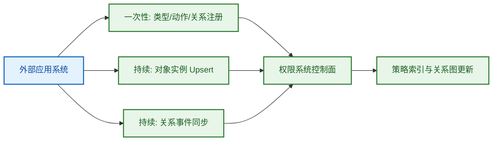

#### 10.4.2 数据面：每个 Action 统一鉴权

外部系统每个受控 action 都应经过统一鉴权逻辑（PEP -> PDP），最小请求上下文为：

1. `subject`：发起者（用户/服务账号）及属性。  
2. `action`：本次动作。  
3. `resource/object`：目标对象标识与关键属性。  
4. `context`：环境上下文（时间、终端、会话、风险标签）。

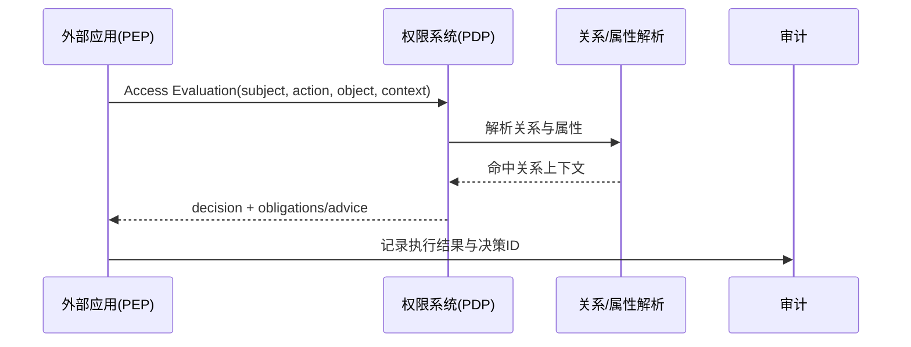

#### 10.4.3 协议与标准映射（推荐）

| 接入能力 | 推荐标准/协议 | 作用说明 |
| --- | --- | --- |
| PEP-PDP 实时鉴权 API | OpenID AuthZEN Authorization API 1.0 | 标准化 `evaluation/evaluations/search` 风格接口 |
| PEP-PDP JSON 请求/响应 | OASIS XACML JSON/HTTP Profile 1.1 | 定义 PEP 与 PDP 的 JSON 接口语义 |
| REST 架构下 XACML 使用 | OASIS XACML REST Profile 1.1 | 规范 XACML 在 REST 架构中的用法 |
| 主体与组织同步 | IETF SCIM（RFC 7644/7643） | 标准化用户与组的跨域同步 |
| 访问令牌上下文校验 | OAuth 2.0 Bearer（RFC 6750）+ Token Introspection（RFC 7662） | 获取 token 是否有效及其上下文元数据 |
| 网关统一拦截鉴权 | Envoy ext_authz filter | 在网关层统一接 PDP，减少业务侧重复接入 |
| 资源注册参考模型 | UMA 2.0（Kantara，Protection API 与资源注册模型） | 作为“对象注册”接口语义参考 |

说明：

1. 业界对“对象注册”尚无单一统一互联网标准，通常采用“标准思想 + 自定义资源注册 API”。  
2. 对你描述的场景，最推荐的落地拆分是：  
   a. 一次性注册 `资源类型与动作目录`。  
   b. 持续同步 `对象实例与关系事件`。  
   c. 每次 action 走 `实时鉴权`。

#### 10.4.4 接入兼容模式

为兼容不同成熟度的外部系统，建议三档接入：

1. `bridge_minimal`：仅实时鉴权，对象按需懒注册。  
2. `bridge_standard`：实时鉴权 + 对象增量同步 + 主体 SCIM 同步。  
3. `bridge_enterprise`：标准模式 + 网关 ext_authz + 发布门禁联动。

兼容性结论：

1. 旧系统可先从 `bridge_minimal` 接入，不阻塞上线。  
2. 随治理成熟度提升，再切到 `bridge_standard/enterprise`。  
3. 该分层与第 5.6 的 `compat_open/balanced/strict` 能协同收敛。

#### 10.4.5 外部系统接入清单（按系统类型）

为便于实施排期，建议按系统类型使用分层接入清单。

| 系统类型 | 最小接入项（必做） | 推荐接入项（增强） | 常见风险 | 验收标准 |
| --- | --- | --- | --- | --- |
| SaaS 外部应用 | 对象类型/动作目录一次性注册；每个受控 action 实时鉴权；对象创建时满足硬必填 | 对象增量同步；关系事件同步；SCIM 主体同步 | 只做一次性注册导致对象集过期；token 上下文不完整 | 抽样 action 100% 经过 PEP；新建对象 5 分钟内可判权；拒绝链路可回放 |
| 内部微服务 | 服务内统一 PEP SDK；统一鉴权请求结构（subject/action/object/context）；失败默认拒绝 | 本地短缓存 + 风险动作强一致；批量鉴权接口；标准审计事件 | 各服务自行封装导致语义漂移；缓存失效策略不一致 | 同类请求跨服务判定一致；高敏动作无缓存越权；审计字段完整 |
| API 网关统一接入 | 网关层 ext_authz 强制拦截；统一透传 subject/object 上下文；P0 门禁联动 | 服务内二次细粒度鉴权；评估结果回传业务日志；灰度路由对比 | 仅网关粗粒度校验导致服务内细粒度缺失；上下文字段丢失 | 网关拦截覆盖率 100%；关键接口双层鉴权；灰度差异可量化 |

实施建议：

1. 优先接入“高价值高风险系统”，先覆盖高敏动作链路。  
2. 先统一 `action` 命名与 `object_type` 目录，再扩展关系同步。  
3. 接入完成后必须运行“发布前模拟 + 线上影子对比”双验证。

#### 10.4.6 接入实施流程（可直接用于排期）


阶段产物要求：

1. 步骤 2 产物：类型/动作/关系注册清单。  
2. 步骤 3 产物：PEP 接入点清单与覆盖率报表。  
3. 步骤 4 产物：对象同步延迟与关系事件丢失率指标。  
4. 步骤 5 产物：门禁校验报告与阻断项清单。  
5. 步骤 6 产物：新旧判定差异报告与收敛结论。

#### 10.4.7 多模型租户的路由语义（新增）

当同一租户存在多个已发布模型时，**不得默认并集求值**，必须通过“模型路由表”显式选择单次鉴权所用模型。

路由主键建议：

1. `namespace`（业务域/系统命名空间）  
2. `tenant_id`（租户）  
3. `environment`（如 `dev/staging/prod`）

路由值建议：

1. `model_id`（目标模型）  
2. `model_version`（可选，缺省表示取该模型最新已发布版本）  
3. `publish_id`（可选，固定到某次发布快照）

约束规则：

1. 单次决策只解析一个模型快照，避免跨模型隐式冲突。  
2. 路由绑定的模型必须处于已发布状态。  
3. `route.tenant_id` 必须与 `model_meta.tenant_id` 一致。  
4. 未命中路由时返回显式错误，不做“猜测模型”回退。

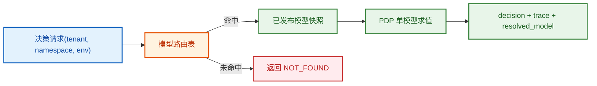

## 11. 可配置边界（平台强制 vs 企业可配）

| 决策项 | 默认值 | 平台强制边界 | 企业可配置范围 | 不建议开放项 |
| --- | --- | --- | --- | --- |
| D1 四值决策语义 | `allow/deny/not_applicable/indeterminate` | 必须保留四值全集 | 可配置对外展示映射 | 把 `indeterminate` 并入 `allow` |
| D2 合并算法 | `deny-overrides` | 高敏域必须可强制 `deny-overrides` | 可按资源域切换算法 | 全局仅 `permit-overrides` |
| D3 obligations/advice | obligations 开启 | 高敏动作必须支持 obligations | advice 可开关、义务模板可扩展 | 完全关闭 obligations |
| D4 SoD + 基数约束 | 开启 | 关键治理动作必须 SoD | 阈值、范围、例外流程可配 | 生产关闭 SoD |
| D5 属性质量语义 | 开启 | 关键属性必须有来源与时效 | freshness 阈值、可信源白名单可配 | 接受未知来源且无限期有效属性 |
| D6 持续授权 | `Pre` 开启 | 长任务必须可中途复核与中止 | 复核频率、触发事件可配 | 长任务只做入口鉴权 |
| D7 一致性语义 | 高敏 `strong` | 高敏写必须强一致策略读取 | 低风险读可设 `eventual` | 高敏域仅 eventual |

## 12. 代表性配置样例

以下样例用于表达模型能力，不绑定具体实现技术。

### 12.1 样例 A：研发导向型企业（效率优先）

```yaml
tenant_profile: r_and_d_balanced
decision_semantics:
  values: [allow, deny, not_applicable, indeterminate]
  expose_mapping:
    not_applicable: 未命中策略
    indeterminate: 条件不足
combining:
  default: deny-overrides
  overrides:
    - object_domain: "workspace.public_assets"
      algorithm: permit-overrides
obligations:
  enabled: true
  required_on:
    - "action in [grant, revoke, publish]"
  templates:
    - id: audit_write
      action: 写入审计日志
constraints:
  sod:
    enabled: true
    rules:
      - id: finance_dual_control
        forbidden_combination:
          - approve_payment
          - execute_payment
  cardinality:
    - target_role: tenant_super_admin
      max_count: 3
consistency:
  high_risk_actions: strong
  default_read: bounded_staleness
  bounded_staleness_ms: 3000
continuous_authorization:
  pre: true
  ongoing:
    enabled: true
    apply_to: [streaming_task, long_running_job]
    interval_sec: 60
  post:
    enabled: true
    apply_to: [grant, export]
```

### 12.2 样例 B：强合规企业（审慎优先）

```yaml
tenant_profile: strict_compliance
decision_semantics:
  values: [allow, deny, not_applicable, indeterminate]
  fail_closed_on: [indeterminate, not_applicable]
combining:
  default: deny-overrides
  disallow_algorithms: [permit-overrides]
obligations:
  enabled: true
  required_on:
    - "object.sensitivity == high"
    - "action in [read, export, grant, revoke, delete]"
  templates:
    - id: step_up_mfa
      action: 二次认证
    - id: pii_masking
      action: 返回结果脱敏
    - id: dual_approval
      action: 双人审批
constraints:
  sod:
    enabled: true
    strict_mode: true
    rules:
      - id: policy_change_guardrail
        forbidden_combination:
          - policy_publish
          - policy_approve
  cardinality:
    - target_role: tenant_root
      max_count: 2
attribute_quality:
  authority_whitelist: [hr_system, iam_system]
  freshness_ttl_sec:
    department_membership: 900
    manager_relation: 300
  reject_unknown_source: true
consistency:
  high_risk_actions: strong
  high_sensitivity_read: strong
  default_read: bounded_staleness
  bounded_staleness_ms: 1000
continuous_authorization:
  pre: true
  ongoing:
    enabled: true
    interval_sec: 30
    revoke_on_relation_change: true
  post:
    enabled: true
    mandatory_evidence: true
```

### 12.3 样例 C：跨组织协作企业（矩阵协作）

```yaml
tenant_profile: matrix_collaboration
subject_relations:
  required_types: [belongs_to, member_of, manages, delegates_to, collaborate_with]
  virtual_group:
    enabled: true
    ttl_days: 90
    renewal_required: true
object_relations:
  propagation_rules:
    - relation: contains
      allow_inherit: true
    - relation: derives_to
      allow_inherit: conditional
      conditions:
        - "source.sensitivity != high"
        - "derived.owner in source.allowed_collaborators"
combining:
  default: deny-overrides
  per_domain:
    - object_domain: project_space
      algorithm: first-applicable
decision_output:
  include_relation_path: true
  include_overridden_rules: true
consistency:
  collaboration_read: bounded_staleness
  bounded_staleness_ms: 5000
  governance_actions: strong
```

### 12.4 样例 D：主体移除事件配置（动态关系核心样例）

```yaml
lifecycle:
  on_subject_removed:
    revoke_direct_edges: immediate
    terminate_delegations: immediate
    recompute_inherited_permissions: immediate
    orphan_object_handling:
      mode: takeover_queue
      fallback_owner: tenant_security_officer
      max_pending_hours: 24
    audit:
      freeze_history: true
      generate_impact_report: true
      report_scope:
        - affected_subjects
        - affected_objects
        - revoked_actions
```

### 12.5 样例 E：策略表达双视图（人类可读 + 机器可读）

人类可读：

1. 部门管理员可管理本部门普通资产。  
2. 高敏资产上部门管理员仅可读不可删。  
3. 项目协作成员可读项目衍生资产，不可发布到源空间。

机器可读（示意）：

```yaml
policies:
  - id: dept_admin_manage_normal
    subject_selector: "subject.relations includes manages(department:{dept_id})"
    object_selector: "object.owner_department == {dept_id} and object.sensitivity == normal"
    action_set: [read, update, grant]
    effect: allow
    priority: 100

  - id: dept_admin_no_delete_high
    subject_selector: "subject.relations includes manages(department:{dept_id})"
    object_selector: "object.owner_department == {dept_id} and object.sensitivity == high"
    action_set: [delete]
    effect: deny
    priority: 200

  - id: project_member_read_derived_only
    subject_selector: "subject.relations includes member_of(project:{project_id})"
    object_selector: "object.relations includes derives_to(from:{source_id}) and object.project_id == {project_id}"
    action_set: [read]
    effect: allow
    priority: 120
```

## 13. 配置语法规范化

本章目标是把“可配置”变成可验证、可落地、可审计的统一语法规范，避免不同租户、不同团队写出语义不一致的策略配置。

### 13.1 规范化目标

1. 同一语义只有一种标准表达。  
2. 配置可被机器稳定解析与校验。  
3. 配置变更可做静态风险检查。  
4. 配置可生成统一决策解释链。  
5. 配置可支持版本化与可回滚。

### 13.2 统一配置文档结构

建议每个策略版本使用统一文档结构：

```yaml
model_meta:
  model_id: "tenant_xxx_authz_v20260304"
  tenant_id: "tenant_xxx"
  version: "2026.03.04"
  status: "draft"            # draft/published/archived
  combining_algorithm: "deny-overrides"

catalogs:
  action_catalog: []
  subject_type_catalog: []
  object_type_catalog: []
  relation_type_catalog: []

object_onboarding:
  compatibility_mode: "compat_balanced"   # compat_open/compat_balanced/compat_strict
  default_profile: "minimal"
  profiles: {}
  conditional_required: []

relations:
  subject_relations: []
  object_relations: []
  subject_object_relations: []

policies:
  rules: []

constraints:
  sod_rules: []
  cardinality_rules: []

lifecycle:
  event_rules: []

consistency:
  default_level: "bounded_staleness"
  high_risk_level: "strong"

quality_guardrails:
  attribute_quality: {}
  mandatory_obligations: []
```

### 13.3 字段字典（核心字段）

| 字段 | 类型 | 必填 | 取值约束 | 说明 |
| --- | --- | --- | --- | --- |
| `model_meta.model_id` | string | 是 | 租户内唯一 | 策略模型标识 |
| `model_meta.status` | enum | 是 | `draft/published/archived` | 生命周期状态 |
| `model_meta.combining_algorithm` | enum | 是 | `deny-overrides/permit-overrides/first-applicable/ordered-deny-overrides` | 合并算法 |
| `relations.*.relation_type` | enum | 是 | 在 `relation_type_catalog` 中已注册 | 关系类型 |
| `object_onboarding.compatibility_mode` | enum | 否 | `compat_open/compat_balanced/compat_strict` | 客体入管兼容模式 |
| `object_onboarding.default_profile` | string | 否 | 必须存在于 `profiles` | 默认入管档 |
| `object_onboarding.profiles.*.required_fields` | list | 否 | 字段名列表，至少包含硬必填 | Profile 必填集合 |
| `object_onboarding.conditional_required[]` | list | 否 | 需含 `when` 与 `add_fields` | 条件追加必填 |
| `policies.rules[].id` | string | 是 | 版本内唯一 | 规则标识 |
| `policies.rules[].subject_selector` | expr | 是 | 可解析表达式 | 主体选择器 |
| `policies.rules[].object_selector` | expr | 是 | 可解析表达式 | 客体选择器 |
| `policies.rules[].action_set` | list | 是 | 非空且动作已注册 | 动作集合 |
| `policies.rules[].effect` | enum | 是 | `allow/deny` | 规则效果 |
| `policies.rules[].priority` | int | 是 | 建议 1-10000 | 规则优先级 |
| `policies.rules[].validity` | interval | 否 | `start <= end` | 生效区间 |
| `constraints.sod_rules[]` | list | 否 | 至少 2 个互斥动作 | SoD 约束 |
| `constraints.cardinality_rules[]` | list | 否 | `max_count >= 1` | 基数约束 |
| `lifecycle.event_rules[]` | list | 否 | 事件类型已注册 | 生命周期处理规则 |
| `quality_guardrails.attribute_quality` | object | 否 | 来源/时效可校验 | 属性质量约束 |

### 13.4 语法层规范（简化 DSL）

策略规则建议满足如下简化语法：

```ebnf
Rule            = "rule" RuleId ":" SubjectSelector "," ObjectSelector "," ActionSet "," Effect "," Priority ["," Conditions] ["," Validity] ;
SubjectSelector = "subject(" Expr ")" ;
ObjectSelector  = "object(" Expr ")" ;
ActionSet       = "actions(" Action {"," Action} ")" ;
Effect          = "allow" | "deny" ;
Priority        = "priority(" Integer ")" ;
Conditions      = "when(" Expr ")" ;
Validity        = "during(" TimeStart "," TimeEnd ")" ;
```

表达式约束：

1. 只允许白名单函数与操作符。  
2. 不允许无限递归与不受限图遍历。  
3. 所有外部属性引用必须带来源域前缀。  
4. 条件表达式必须可静态类型检查。

### 13.5 校验流程规范（五层校验）

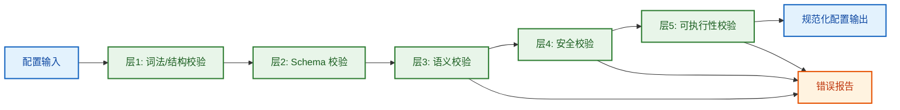

五层校验定义：

1. 词法/结构校验：键名、缩进、基础类型。  
2. Schema 校验：字段必填、枚举、区间、唯一性。  
3. 语义校验：选择器可解析、动作在目录内、关系类型合法。  
4. 安全校验：SoD、高敏策略、越权传播、危险算法组合。  
5. 可执行性校验：obligations 可执行、属性来源可达、一致性级别满足域要求。

### 13.6 冲突检测规则

同版本配置发布前必须执行冲突检测：

1. `规则重叠冲突`：同一主体集、客体集、动作集出现 allow/deny 对立。  
2. `优先级空洞`：冲突规则优先级完全相同且无法由算法消歧。  
3. `不可达规则`：某规则被高优先级通配规则永久遮蔽。  
4. `义务断裂`：allow 生效但 mandatory obligations 未定义。  
5. `高敏降级`：高敏域被配置为弱一致或放宽合并算法。  
6. `生命周期断裂`：关键事件缺失默认处理器（如主体移除）。

### 13.7 规范化与编译产物

配置进入引擎前应做规范化（Normalization）并产出编译结果：

1. 填充默认值（如 `combining_algorithm`、`validity`）。  
2. 展开动作包为原子动作集合。  
3. 将选择器编译为可执行谓词。  
4. 构建规则索引（按主体域、客体域、动作域、优先级）。  
5. 生成可解释元数据（规则来源、覆盖链、证据键）。

### 13.8 错误输出规范

配置校验错误建议统一格式：

```json
{
  "code": "POLICY_CONFLICT",
  "level": "error",
  "path": "policies.rules[12]",
  "message": "规则与 policies.rules[3] 在 read 动作上冲突且优先级不可消歧",
  "suggestion": "调整 priority 或拆分 object_selector",
  "related_rules": ["rule_12", "rule_3"]
}
```

字段约束：

1. `code`：稳定错误码，便于自动处理。  
2. `level`：`error/warning/info`。  
3. `path`：定位到配置路径。  
4. `message`：可读且可复现。  
5. `suggestion`：给出最小修复建议。  
6. `related_rules`：用于冲突联动排查。

### 13.9 语法规范与样例章节的关系

第 12 章给出的是“有代表性的业务配置样例”，第 13 章给出的是“这些样例必须满足的语法与校验规范”。  
两者关系是：样例回答“怎么配”，规范回答“怎样算正确配置”。

### 13.10 错误码清单（Code Enum）

为保证自动化校验、前端提示、审计复盘三方语义一致，错误码必须稳定且可枚举。

| 错误码 | 默认级别 | 触发条件 | 是否阻断发布 | 建议处置 |
| --- | --- | --- | --- | --- |
| `MODEL_META_INVALID` | error | `model_meta` 缺失或状态非法 | 是 | 修正模型元信息 |
| `SCHEMA_VALIDATION_FAILED` | error | JSON Schema 校验失败（类型/必填/枚举/区间） | 是 | 按字段路径修正配置 |
| `DUPLICATE_RULE_ID` | error | 同版本出现重复 `rule.id` | 是 | 规则 ID 去重 |
| `SELECTOR_PARSE_ERROR` | error | 选择器表达式无法解析 | 是 | 修正表达式语法 |
| `SELECTOR_TYPE_MISMATCH` | error | 选择器类型不匹配（主体条件用于客体） | 是 | 修正字段域 |
| `ACTION_NOT_REGISTERED` | error | `action_set` 含未注册动作 | 是 | 补充动作目录或修正规则 |
| `RELATION_TYPE_UNKNOWN` | error | 使用未注册关系类型 | 是 | 先注册关系类型 |
| `PRIORITY_COLLISION` | warning | 冲突规则优先级相同但可被算法消歧 | 否 | 建议调整优先级 |
| `RULE_CONFLICT_UNRESOLVED` | error | allow/deny 冲突且无法消歧 | 是 | 拆分选择器或调整优先级 |
| `RULE_UNREACHABLE` | warning | 规则永久不可达 | 否 | 清理或降级为注释规则 |
| `SOD_VIOLATION` | error | 命中 SoD 互斥约束 | 是 | 调整角色/动作分配 |
| `CARDINALITY_EXCEEDED` | error | 超出基数上限 | 是 | 回收角色或提升阈值审批 |
| `HIGH_SENSITIVITY_DOWNGRADED` | error | 高敏域使用弱一致或高风险算法 | 是 | 恢复强一致/保守算法 |
| `MANDATORY_OBLIGATION_MISSING` | error | allow 规则缺失必需 obligations | 是 | 增补义务模板 |
| `OBLIGATION_NOT_EXECUTABLE` | error | mandatory obligations 在静态检查阶段不可执行（无执行器/无依赖） | 是 | 修复执行链路 |
| `OBLIGATION_EXECUTION_DEGRADED` | warning | obligations 运行成功率低于门禁阈值 | 视域而定 | 修复执行稳定性并收敛阈值 |
| `ATTRIBUTE_SOURCE_UNTRUSTED` | error | 关键属性来源不在可信白名单 | 是 | 改用可信来源 |
| `ATTRIBUTE_STALE` | warning | 关键属性超过 freshness 阈值 | 视域而定 | 刷新属性或收紧策略 |
| `LIFECYCLE_HANDLER_MISSING` | error | 关键事件缺失处理器（如主体移除） | 是 | 补齐事件规则 |
| `INDETERMINATE_RATE_TOO_HIGH` | warning | 预估 `indeterminate` 比率超阈值 | 视域而定 | 补全条件与属性 |
| `OBJECT_HARD_REQUIRED_MISSING` | error | 客体创建缺少硬必填字段 | 是 | 补齐硬必填后重试 |
| `OBJECT_PROFILE_REQUIRED_MISSING` | error | 缺少 Profile 必填字段 | 视兼容模式而定 | 补齐或切换兼容模式 |
| `OBJECT_CONDITIONAL_REQUIRED_MISSING` | warning | 条件必填字段缺失 | 视兼容模式而定 | 限时补录并告警 |
| `OBJECT_ENRICHMENT_OVERDUE` | error | 动态字段补录超时 | 是 | 阻断敏感操作并补录 |
| `PUBLISH_GATE_BLOCKED` | error | 任一阻断门禁未通过 | 是 | 根据门禁报告修复 |

错误码治理要求：

1. `code` 语义稳定，禁止同名复义。  
2. 每个错误码必须映射“是否阻断发布”。  
3. 每个错误码必须有“最小修复建议”。  
4. 高敏域可将部分 warning 升级为 error。

### 13.11 字段约束矩阵（Allowed / Forbidden）

下面矩阵用于统一约束“字段组合是否允许”，避免单字段合法但组合违规。

| 约束编号 | 字段组合 | Allowed | Forbidden | 说明 |
| --- | --- | --- | --- | --- |
| F1 | `effect` × `action_set` | `allow`/`deny` + 非空动作集 | 空动作集 | 空动作规则无语义 |
| F2 | `effect=allow` × `mandatory_obligations` | 高敏动作必须有 obligations | 高敏 allow 且 obligations 为空 | 防止“准入有了、控制缺失” |
| F3 | `object.sensitivity=high` × `consistency` | `strong` 或受控 `bounded_staleness` | `eventual` | 高敏域不可最终一致 |
| F4 | `object.sensitivity=high` × `combining_algorithm` | `deny-overrides` / `ordered-deny-overrides` | 全局 `permit-overrides` | 高敏域拒绝优先 |
| F5 | `subject_selector` × `object_selector` | 均可解析且类型匹配 | 主客体域交叉误用 | 防止错误匹配 |
| F6 | `rule.priority` × 冲突规则 | 同冲突域优先级可消歧 | 同优先级且不可消歧 | 保证裁决确定性 |
| F7 | `validity` × `lifecycle.event_rules` | 关键临时规则有到期处理 | 临时规则无到期行为 | 防止过期权限泄漏 |
| F8 | `delegates_to` × `action_set` | 委派动作受限于委派范围 | 委派超出原主体动作边界 | 防止越权委派 |
| F9 | `attribute_source` × `attribute_quality` | 来源在白名单且未过期 | 未知来源或超时仍放行 | 防止脏属性授权 |
| F10 | `sod_rules` × `role_bindings` | 互斥动作不在同主体聚合 | 同主体同时持有互斥动作 | 内控底线 |
| F11 | `cardinality_rules` × `role_bindings` | 实际数量 `<= max_count` | 实际数量 `> max_count` | 关键角色规模控制 |
| F12 | `indeterminate_policy` × 业务域风险级 | 高风险域 fail-closed | 高风险域 fail-open | 失败默认拒绝 |
| F13 | `compatibility_mode` × `object_required_missing` | `compat_open` 可告警放行、`compat_balanced` 可限时补录 | `compat_strict` 下缺失仍放行 | 入管收敛边界 |

矩阵使用规则：

1. `Forbidden` 组合默认进入阻断门禁。  
2. `Allowed` 组合若触发 warning，可进入人工复核门禁。  
3. 企业租户只能在平台允许范围内扩展矩阵，不得删除平台强制约束。

### 13.12 发布门禁规则与优先级表

发布门禁按优先级分层执行，前一层失败不进入下一层。

| 门禁优先级 | 门禁名称 | 核心检查项 | 失败后动作 |
| --- | --- | --- | --- |
| `P0`（阻断） | 结构与语义完整性门禁 | Schema、选择器可解析、动作/关系已注册、不可消歧冲突为 0 | 直接阻断发布 |
| `P0`（阻断） | 安全底线门禁 | SoD、基数约束、高敏降级、强制 obligations | 直接阻断发布 |
| `P0`（阻断） | 生命周期完整性门禁 | 主体移除等关键事件处理器存在 | 直接阻断发布 |
| `P0`（阻断） | 入管契约完整性门禁 | `default_profile` 可解析、Profile 包含硬必填 | 直接阻断发布 |
| `P1`（强复核） | 可维护性与质量门禁 | 规则不可达比例、优先级碰撞、属性时效风险 | 进入安全/数据治理复核 |
| `P1`（强复核） | 属性可信门禁 | 来源可信度、revocation 时效 | 进入数据治理复核 |
| `P2`（复核） | 运行可执行性门禁 | obligations 执行成功率、依赖可达性退化 | 进入运维复核 |
| `P2`（复核） | 模拟影响门禁 | 高敏影响面、deny 增幅、indeterminate 比率 | 进入业务负责人复核 |
| `P3`（提示） | 治理优化门禁 | 不可达规则清理、优先级规范化、命名规范 | 允许发布并生成治理工单 |

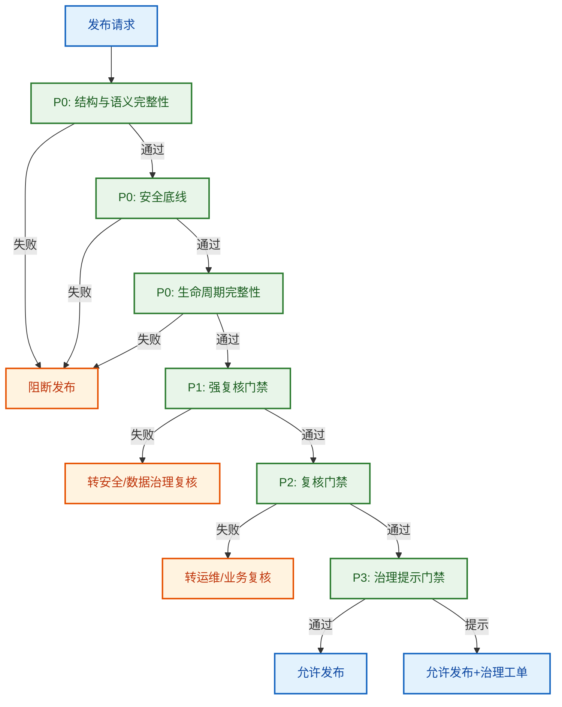

门禁执行约束：

1. `P0` 失败必须阻断，禁止人工跳过。  
2. `P1/P2` 允许复核豁免，但必须留痕与到期回收。  
3. `P3` 不阻断发布，但必须生成治理任务与跟踪编号。  
4. 任一豁免都必须附带“责任人 + 原因 + 失效时间”。

规范补充（与 Schema/门禁样例保持一致）：

1. `object_onboarding` 为顶层必填块，不允许省略。  
2. `model_meta.status=published` 时，`catalogs.action_catalog/object_type_catalog/relation_type_catalog` 与 `policies.rules` 都必须非空。  
3. `RULE_CONFLICT_UNRESOLVED` 与 `OBLIGATION_NOT_EXECUTABLE` 归为 `P0` 阻断项，`OBLIGATION_EXECUTION_DEGRADED` 归为 `P2` 复核项。

### 13.13 配套规范附件

为了降低实现偏差，建议直接使用以下附件作为实现输入：

1. JSON Schema 草案：[`11_权限配置JSON_Schema草案.md`](./11_权限配置JSON_Schema草案.md)。  
2. 发布门禁规则样例：[`12_权限发布门禁规则样例.md`](./12_权限发布门禁规则样例.md)。

## 14. 可视化管理与页面形态

仅文字描述不够，权限治理需要可交互的可视化视图。

### 14.1 权限控制台信息架构（页面形态）

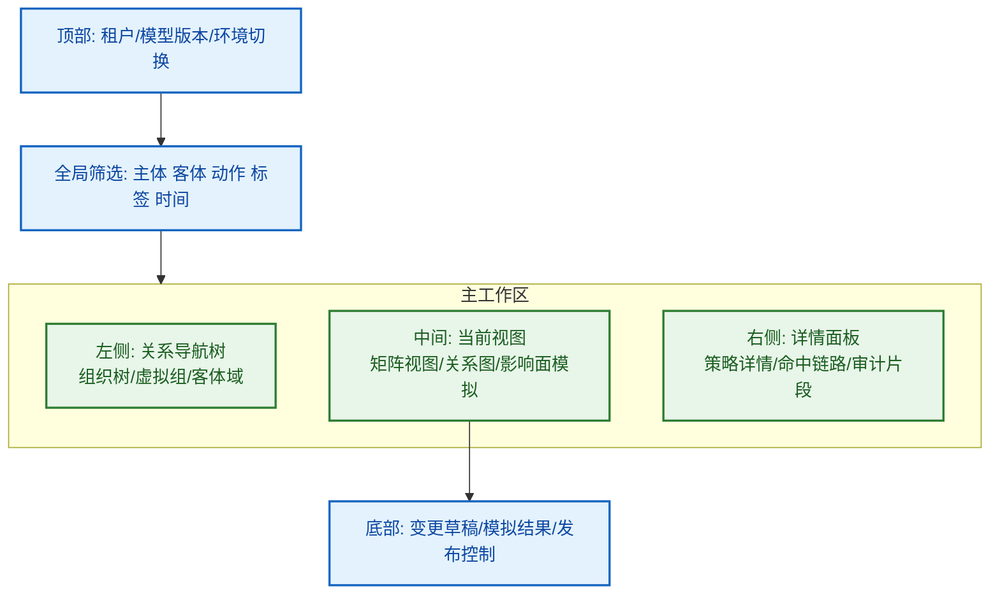

### 14.2 权限矩阵视图（交互逻辑）

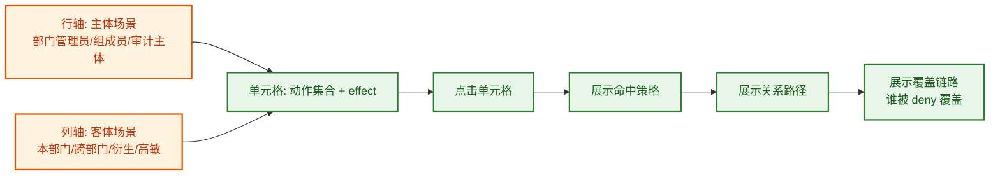

### 14.3 关系图视图（结构 + 治理 + 委派）

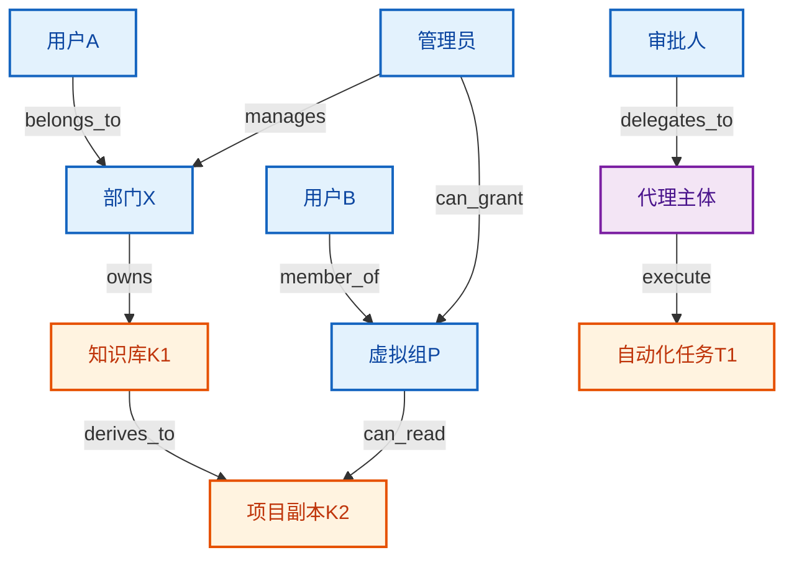

### 14.4 影响面模拟视图（变更前后对比）

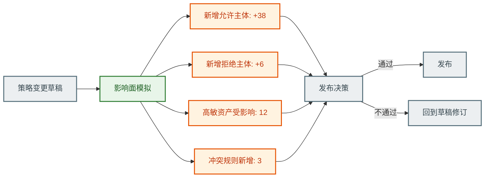

### 14.5 决策回放视图（单次鉴权解释）

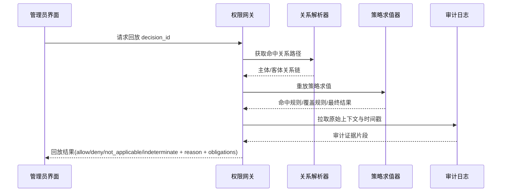

### 14.6 矩阵单元格详情抽屉（字段级线框）

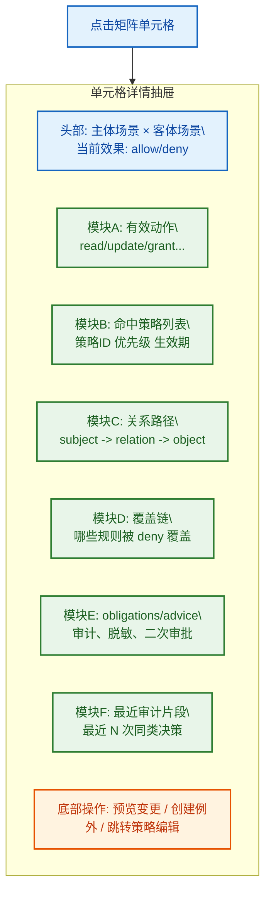

抽屉必备字段：

1. `cell_key`：`subject_scene + object_scene + model_version`。  
2. `final_decision`：四值决策结果与合并算法。  
3. `effective_actions`：最终可执行动作集合。  
4. `matched_rules` 与 `overridden_rules`：用于解释冲突裁决。  
5. `relation_path`：最短命中路径与全路径计数。  
6. `obligations/advice`：执行义务与建议动作。  
7. `recent_decisions`：同场景最近决策样本（用于复盘）。

### 14.7 发布前模拟报告（固定模板）

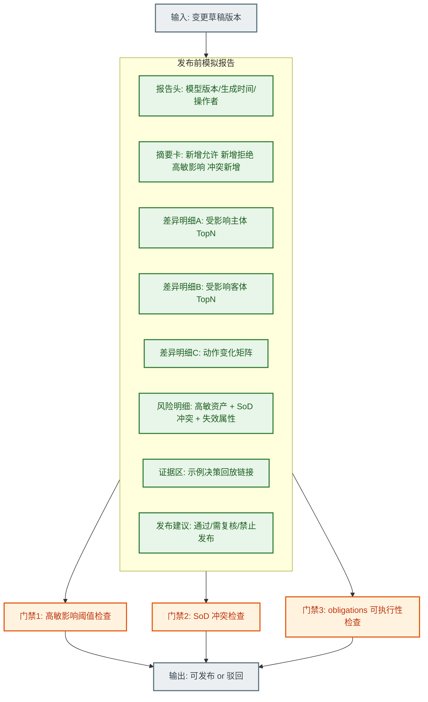

报告模板必备指标：

1. `delta_allow_subject_count`、`delta_deny_subject_count`。  
2. `delta_high_sensitivity_object_count`。  
3. `new_conflict_rule_count`、`new_sod_violation_count`。  
4. `indeterminate_rate_estimation`（防止规则不完整上线）。  
5. `top_impacted_subjects`、`top_impacted_objects`。  
6. `mandatory_obligations_pass_rate`。  
7. `publish_recommendation`（通过/需复核/禁止发布）与理由。

## 15. 完整性校验清单

### 15.1 表达能力

1. 是否同时支持树形组织与网状协作。  
2. 是否区分“归属关系”与“管理关系”。  
3. 是否表达客体衍生/依赖引发的权限联动。

### 15.2 动态稳定性

1. 主体离开后权限是否自动收敛。  
2. 客体转移后审计链是否连续。  
3. 大规模组织调整后是否仍可解释。

### 15.3 治理可用性

1. 管理者是否可看懂当前权限状态。  
2. 变更前是否可模拟影响面。  
3. 争议时是否可回放证据链。

## 16. 设计结论

本模型将企业权限定义为“关系网络 + 策略语义 + 生命周期规则 + 可视化治理”的统一系统。

核心结论：

1. 静态角色不足以覆盖企业权限本质，必须以关系图为中心。  
2. 动态事件与持续授权是防止权限失真的必要条件。  
3. 决策语义、合并算法、约束模型必须显式化并可审计。  
4. 可配置边界必须分清平台底线与租户差异化空间。  
5. 可视化不只是展示层，而是治理能力本身。

## 17. 参考资料（权威资料）

1. NIST RBAC 项目（含标准化背景）：<https://csrc.nist.gov/projects/role-based-access-control>  
2. NIST SP 800-162（ABAC）：<https://csrc.nist.gov/pubs/sp/800/162/upd2/final>  
3. NIST SP 800-178（ABAC/NGAC 对比与实践）：<https://csrc.nist.gov/pubs/sp/800/178/final>  
4. NIST SP 800-205（Attribute Considerations for Access Control Systems）：<https://csrc.nist.gov/pubs/sp/800/205/final>  
5. Sandhu 等《Role-based access control models》（1996）：<https://doi.org/10.1109/2.485845>  
6. Sandhu 等《The NIST Model for Role-Based Access Control》（2000）：<https://doi.org/10.1145/344287.344301>  
7. Park, Sandhu《The UCONABC usage control model》（2004）：<https://doi.org/10.1145/984334.984339>  
8. Fong《Relationship-based access control》（2011）：<https://doi.org/10.1145/1943513.1943539>  
9. Fong, Siahaan《Relationship-based access control policies and their policy languages》（2011）：<https://doi.org/10.1145/1998441.1998450>  
10. Google Zanzibar 论文页：<https://research.google/pubs/zanzibar-googles-consistent-global-authorization-system/>  
11. Zanzibar 论文（USENIX ATC 2019）：<https://www.usenix.org/conference/atc19/presentation/pang>  
12. OpenFGA 建模文档：<https://openfga.dev/docs/modeling/getting-started>  
13. OASIS XACML 主页：<https://www.oasis-open.org/committees/xacml/>  
14. XACML 3.0 Core 规范：<https://docs.oasis-open.org/xacml/3.0/xacml-3.0-core-spec-os-en.html>  
15. XACML REST Profile 1.1：<https://docs.oasis-open.org/xacml/xacml-rest/v1.1/os/xacml-rest-v1.1-os.html>  
16. XACML JSON/HTTP Profile 1.1：<https://docs.oasis-open.org/xacml/xacml-json-http/v1.1/os/xacml-json-http-v1.1-os.html>  
17. OpenID AuthZEN Authorization API 1.0：<https://openid.github.io/authzen/>  
18. SCIM Protocol（RFC 7644）：<https://www.rfc-editor.org/rfc/rfc7644>  
19. SCIM Core Schema（RFC 7643）：<https://www.rfc-editor.org/rfc/rfc7643>  
20. OAuth 2.0 Bearer Token Usage（RFC 6750）：<https://www.rfc-editor.org/rfc/rfc6750>  
21. OAuth 2.0 Token Introspection（RFC 7662）：<https://www.rfc-editor.org/rfc/rfc7662>  
22. UMA 2.0 Grant for OAuth 2.0 Authorization（Kantara）：<https://docs.kantarainitiative.org/uma/wg/oauth-uma-grant-2.0.html>  
23. Envoy ext_authz filter：<https://www.envoyproxy.io/docs/envoy/latest/configuration/http/http_filters/ext_authz_filter>  
24. AWS IAM 策略评估逻辑：<https://docs.aws.amazon.com/IAM/latest/UserGuide/reference_policies_evaluation-logic.html>  
25. Azure RBAC Scope：<https://learn.microsoft.com/en-us/azure/role-based-access-control/scope-overview>  
26. Open Policy Agent 文档：<https://www.openpolicyagent.org/docs/latest/>
