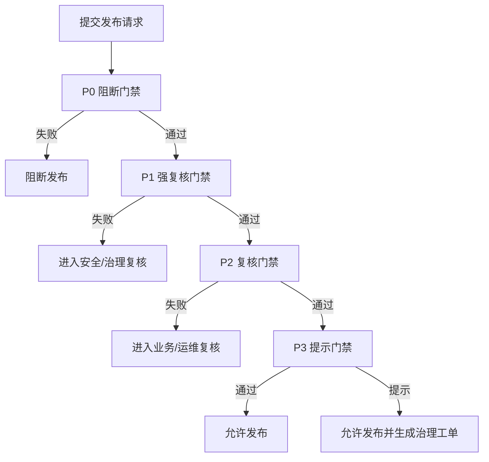

# 权限发布门禁规则样例

> 文档编号：56  
> 更新日期：2026-03-04  
> 对应主文档：[`10_企业可配置权限模型设计.md`](./10_企业可配置权限模型设计.md) 第 13.12 节

## 1. 目标

给出一套可直接用于实现的发布门禁规则样例，包含：

1. 分层门禁定义（`P0/P1/P2/P3`）。  
2. 默认阈值（基础版与强合规版）。  
3. 触发逻辑与动作（阻断/复核/放行+工单）。  
4. 输出结果结构。

## 2. 门禁执行总流程



## 3. 门禁配置样例（基础版）

```yaml
gate_profile: baseline

priority_order: [P0, P1, P2, P3]

P0:
  block_on_fail: true
  rules:
    - id: p0_schema_valid
      code: SCHEMA_VALIDATION_FAILED
      check: "schema.valid == true"
      on_fail: block

    - id: p0_selector_parse
      code: SELECTOR_PARSE_ERROR
      check: "semantic.selector_parse_error_count == 0"
      on_fail: block

    - id: p0_action_registered
      code: ACTION_NOT_REGISTERED
      check: "semantic.unregistered_action_count == 0"
      on_fail: block

    - id: p0_relation_registered
      code: RELATION_TYPE_UNKNOWN
      check: "semantic.unknown_relation_type_count == 0"
      on_fail: block

    - id: p0_unresolved_conflict
      code: RULE_CONFLICT_UNRESOLVED
      check: "conflict.unresolved_count == 0"
      on_fail: block

    - id: p0_sod
      code: SOD_VIOLATION
      check: "security.sod_violation_count == 0"
      on_fail: block

    - id: p0_high_sensitivity_consistency
      code: HIGH_SENSITIVITY_DOWNGRADED
      check: "security.high_sensitivity_eventual_count == 0"
      on_fail: block

    - id: p0_lifecycle_handler
      code: LIFECYCLE_HANDLER_MISSING
      check: "lifecycle.required_handler_missing_count == 0"
      on_fail: block

    - id: p0_onboarding_contract
      code: OBJECT_PROFILE_REQUIRED_MISSING
      check: "onboarding.default_profile_exists == true and onboarding.profile_include_hard_required == true"
      on_fail: block

    - id: p0_obligation_executable_static
      code: OBLIGATION_NOT_EXECUTABLE
      check: "execution.mandatory_obligation_static_unexecutable_count == 0"
      on_fail: block

P1:
  block_on_fail: false
  require_human_review: true
  rules:
    - id: p1_attribute_source
      code: ATTRIBUTE_SOURCE_UNTRUSTED
      check: "attribute.untrusted_source_count == 0"
      on_fail: review_data_governance

P2:
  block_on_fail: false
  require_human_review: true
  rules:
    - id: p2_obligation_exec
      code: OBLIGATION_EXECUTION_DEGRADED
      check: "execution.mandatory_obligation_pass_rate >= 0.99"
      on_fail: review_ops

    - id: p2_indeterminate_rate
      code: INDETERMINATE_RATE_TOO_HIGH
      check: "simulation.indeterminate_rate <= 0.02"
      on_fail: review_business_owner

P3:
  block_on_fail: false
  require_human_review: false
  rules:
    - id: p3_unreachable_ratio
      code: RULE_UNREACHABLE
      check: "quality.unreachable_rule_ratio <= 0.15"
      on_fail: open_governance_ticket

    - id: p3_priority_style
      code: PRIORITY_COLLISION
      check: "quality.priority_collision_ratio <= 0.10"
      on_fail: open_governance_ticket
```

## 4. 门禁配置样例（强合规版）

```yaml
gate_profile: strict_compliance

priority_order: [P0, P1, P2, P3]

P0:
  block_on_fail: true
  rules:
    - id: p0_schema_valid
      code: SCHEMA_VALIDATION_FAILED
      check: "schema.valid == true"
      on_fail: block

    - id: p0_selector_parse
      code: SELECTOR_PARSE_ERROR
      check: "semantic.selector_parse_error_count == 0"
      on_fail: block

    - id: p0_action_registered
      code: ACTION_NOT_REGISTERED
      check: "semantic.unregistered_action_count == 0"
      on_fail: block

    - id: p0_relation_registered
      code: RELATION_TYPE_UNKNOWN
      check: "semantic.unknown_relation_type_count == 0"
      on_fail: block

    - id: p0_unresolved_conflict
      code: RULE_CONFLICT_UNRESOLVED
      check: "conflict.unresolved_count == 0"
      on_fail: block

    - id: p0_sod
      code: SOD_VIOLATION
      check: "security.sod_violation_count == 0"
      on_fail: block

    - id: p0_cardinality
      code: CARDINALITY_EXCEEDED
      check: "security.cardinality_exceeded_count == 0"
      on_fail: block

    - id: p0_high_sensitivity_consistency
      code: HIGH_SENSITIVITY_DOWNGRADED
      check: "security.high_sensitivity_eventual_count == 0 and security.high_sensitivity_weak_staleness_count == 0"
      on_fail: block

    - id: p0_mandatory_obligation
      code: MANDATORY_OBLIGATION_MISSING
      check: "security.mandatory_obligation_missing_count == 0"
      on_fail: block

    - id: p0_lifecycle_handler
      code: LIFECYCLE_HANDLER_MISSING
      check: "lifecycle.required_handler_missing_count == 0"
      on_fail: block

    - id: p0_onboarding_contract
      code: OBJECT_PROFILE_REQUIRED_MISSING
      check: "onboarding.default_profile_exists == true and onboarding.profile_include_hard_required == true and onboarding.strict_mode_violation_count == 0"
      on_fail: block

    - id: p0_obligation_executable_static
      code: OBLIGATION_NOT_EXECUTABLE
      check: "execution.mandatory_obligation_static_unexecutable_count == 0"
      on_fail: block

P1:
  block_on_fail: false
  require_human_review: true
  rules:
    - id: p1_attribute_source
      code: ATTRIBUTE_SOURCE_UNTRUSTED
      check: "attribute.untrusted_source_count == 0"
      on_fail: review_data_governance

    - id: p1_attribute_stale
      code: ATTRIBUTE_STALE
      check: "attribute.stale_count == 0"
      on_fail: review_data_governance

P2:
  block_on_fail: false
  require_human_review: true
  rules:
    - id: p2_obligation_exec
      code: OBLIGATION_EXECUTION_DEGRADED
      check: "execution.mandatory_obligation_pass_rate >= 0.999"
      on_fail: review_ops

    - id: p2_indeterminate_rate
      code: INDETERMINATE_RATE_TOO_HIGH
      check: "simulation.indeterminate_rate <= 0.005"
      on_fail: review_business_owner

P3:
  block_on_fail: false
  require_human_review: false
  rules:
    - id: p3_unreachable_ratio
      code: RULE_UNREACHABLE
      check: "quality.unreachable_rule_ratio <= 0.05"
      on_fail: open_governance_ticket

    - id: p3_priority_style
      code: PRIORITY_COLLISION
      check: "quality.priority_collision_ratio <= 0.03"
      on_fail: open_governance_ticket
```

## 5. 阈值建议对照表

| 指标 | 基础版阈值 | 强合规阈值 | 说明 |
| --- | --- | --- | --- |
| `execution.mandatory_obligation_static_unexecutable_count` | `= 0` | `= 0` | mandatory obligations 静态可执行性（P0 阻断） |
| `simulation.indeterminate_rate` | `<= 2%` | `<= 0.5%` | 规则完整性风险 |
| `execution.mandatory_obligation_pass_rate` | `>= 99%` | `>= 99.9%` | 后置控制可执行性 |
| `quality.unreachable_rule_ratio` | `<= 15%` | `<= 5%` | 策略冗余与维护成本 |
| `quality.priority_collision_ratio` | `<= 10%` | `<= 3%` | 冲突可解释性 |

## 6. 门禁输出结构样例

```json
{
  "publish_id": "pub_20260304_001",
  "profile": "strict_compliance",
  "final_result": "blocked",
  "gates": [
    {
      "level": "P0",
      "rule_id": "p0_mandatory_obligation",
      "code": "MANDATORY_OBLIGATION_MISSING",
      "passed": false,
      "decision": "block",
      "detail": "high_sensitivity allow 规则缺失 mandatory obligations"
    }
  ],
  "review_required": false,
  "tickets": []
}
```

## 7. 复核豁免规范

对 `P1/P2` 失败项允许豁免，但必须满足：

1. 指定责任人。  
2. 填写豁免原因。  
3. 填写失效时间（到期自动失效）。  
4. 记录审批人与审批时间。  
5. 自动生成追踪工单。

不允许豁免：

1. `P0` 任意失败项。  
2. 已触发法定合规强制约束的失败项。

## 8. 与主文档映射关系

1. 对应 `10` 文档第 `13.12` 的分级门禁思想。  
2. 对应 `10` 文档第 `13.10` 的错误码语义。  
3. 对应 `10` 文档第 `14.7` 的“发布前模拟报告”。
