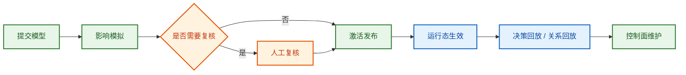

# 企业ACL用户操作手册

> 文档编号：14  
> 更新日期：2026-03-07  
> 面向对象：租户管理员、权限管理员、复核人、日常操作人员  
> 术语遵循 [00_术语统一规范](./00_术语统一规范.md)  
> 相关文档：建模与配置详见 [15_企业ACL建模与配置指南.md](./15_企业ACL建模与配置指南.md)，设计原理详见 [10_企业可配置权限模型开发设计.md](./10_企业可配置权限模型开发设计.md)，配置结构详见 [11_权限配置JSON_Schema草案.md](./11_权限配置JSON_Schema草案.md)，发布门禁详见 [12_权限发布门禁规则样例.md](./12_权限发布门禁规则样例.md)

## 1. 文档定位

本文档是一份**操作手册**，重点讲控制台页面怎么使用、日常治理按什么顺序操作、出现问题去哪里排查。

1. 这个系统解决什么问题。  
2. 控制台每个页面是做什么的。  
3. 日常权限治理应该按什么顺序操作。  
4. 遇到权限争议、上线变更、关系调整时该去哪里看。  
5. 哪些概念是使用时必须理解的，哪些实现细节可以先不关心。

如果你需要理解系统设计原理、权限模型如何写、实例数据如何添加，请优先阅读 [15_企业ACL建模与配置指南.md](./15_企业ACL建模与配置指南.md)；如果你的目标是日常发布、模拟、回放、控制面维护，请优先阅读本文档。

## 2. 系统概览

企业 ACL 系统不是单纯的“角色列表”工具，而是一套围绕以下能力建设的治理系统：

1. **发布流程治理**：新模型上线前先校验、再模拟、再复核、再发布。  
2. **权限结果解释**：任何一次判权都可以回放命中规则与最终结果。  
3. **关系驱动授权**：权限不只来自静态角色，也来自组织、项目、委派、归属、owner 等关系。  
4. **运行态控制面维护**：客体台账、关系边、模型路由按 `namespace` 独立维护。  
5. **变更影响评估**：发布前能够看到哪些主体、客体、动作会发生变化。

一句话理解：

> 这个系统用来管理“谁（Subject）在什么条件下，对什么对象（Object）执行什么动作（Action）”，并把发布、模拟、回放、关系维护放到同一个治理闭环里。

### 2.1 使用者最常接触的四条主线

这张图对应系统里最重要的四类操作：

1. **发布**：把模型提交给系统。  
2. **模拟**：查看变更影响。  
3. **回放**：解释具体权限结果。  
4. **维护**：维护运行态对象、关系与路由。

## 3. 先理解几个核心概念

先理解下面 11 个概念，再去看页面和操作，会轻松很多。

### 3.1 `namespace`

`namespace` 是运行态数据的隔离空间，用来隔离对象、关系、路由和审计数据。它**不等同于租户**，更接近“租户下某个业务域或系统边界对应的权限工作区”。

例子：`tenant_a.crm` 和 `tenant_a.kb` 最好分成两个 `namespace`，避免对象、关系和路由混在一起。

### 3.2 `tenant`

`tenant` 是租户边界，代表一组模型、数据和治理责任归属于谁。

例子：`tenant_techcorp` 是租户；这个租户下面可以同时有 `tenant_techcorp.crm`、`tenant_techcorp.kb`、`tenant_techcorp.workflow` 多个 `namespace`。

### 3.3 `subject`

`subject` 是动作的发起方，不一定只是“用户”，也可以是员工、部门、岗位、服务账号或代理身份。

例子：员工张三查看知识库、值班角色审批变更、服务账号调用接口，这里的发起方都是 `subject`。

### 3.4 `object`

`object` 是被访问或被管理的目标，例如知识库、文档空间、流程、服务、项目空间。

例子：张三想查看 `kb_finance_001`，这个知识库条目就是 `object`。

### 3.5 `action`

`action` 是 `subject` 想对 `object` 执行的操作，例如 `read`、`update`、`approve`、`grant`。

例子：同一个人对同一个知识库，`read` 可能允许，但 `grant` 可能拒绝。

### 3.6 `relation`

`relation` 是主体与主体、客体与客体、主体与客体之间的关系。

例子：某员工 `belongs_to` 财务部、某人 `member_of` 项目组、某知识库的 `owner_ref` 指向某负责人，这些都会影响权限结果。

### 3.7 `context`

`context` 是判权时附带的上下文条件，例如时间、环境、命名空间、风险标签、请求来源。

例子：同样是 `approve` 动作，在发布窗口内可能允许，窗口外可能拒绝；这就是 `context` 在起作用。

### 3.8 `model`

`model` 是权限策略模型，规定系统支持哪些类型、动作、关系和规则。

例子：你在控制台里选择模板、编辑规则、提交发布，本质上都是在维护 `model`。

### 3.9 `publish`

`publish` 是一次模型发布流程记录，可以理解为一次权限变更上线单。

例子：某次模型修改提交后生成一个 `publish_id`，它会经历门禁、复核、激活，最终变成 `published` 或被驳回。

### 3.10 `simulation`

`simulation` 是发布前的影响面模拟报告，用来查看这次变更会影响哪些主体、客体和动作。

例子：一条新规则可能让更多人能读取高敏感知识库，那么这个风险会在 `simulation` 里体现出来。

### 3.11 `decision`

`decision` 是一次具体的权限判定记录，里面会保存最终结果、命中规则和 trace。

例子：当业务方问“为什么张三看不到这篇文档”时，最直接的排查入口就是对应的 `decision_id`。

## 4. 控制台导航说明

当前控制台的一级导航，建议按以下心智理解：

| 一级标签 | 主要用途 | 最适合什么时候打开 |
| --- | --- | --- |
| `发布流程` | 查看发布请求列表、详情、复核、激活 | 模型准备上线时 |
| `影响模拟` | 查看模拟报告、变化矩阵、影响排行 | 评估风险时 |
| `关系回放` | 看关系边与决策 trace | 排查权限争议时 |
| `控制面维护` | 上半区做模型提交，下半区做 `namespace` 下的 instance 维护 | 日常维护与数据准备时 |
| `组件索引` | 查看可嵌入组件与链接 | 做集成展示时 |

推荐的默认操作顺序是：

1. 在 `控制面维护` 准备运行态数据。  
2. 在 `发布流程` 提交模型。  
3. 在 `影响模拟` 评估变更。  
4. 回到 `发布流程` 做复核与激活。  
5. 上线后通过 `关系回放` 和 `决策回放` 做验证与排查。

## 5. 快速上手

如果你是第一次使用系统，建议按下面 5 步开始。

### 5.1 第一步：确认工作空间

进入控制台后，先在 `控制面维护` 的 `Instance 导入 / 维护 / 展示` 卡片中确认当前使用的 `namespace`：

1. 这是后续对象、关系、路由和搜索的上下文。  
2. 切换 `namespace` 会影响你看到的运行态数据。  
3. 如果你在不同环境或不同业务域操作，请避免混用同一个 `namespace`。  
4. `tenant` 决定归属边界，`namespace` 决定当前操作落在哪个运行空间里，两者不要混为一谈。

当前页面结构可以这样理解：

1. `控制面总览` 上半区偏向模型与发布。  
2. 上半区会显式展示当前 `tenant` 上下文，用于说明模型与发布归属。  
3. 从 `Instance 导入 / 维护 / 展示` 卡片开始，才进入运行态工作区。  
4. 因此 `namespace` 切换入口放在该卡片上方更符合使用心智。

### 5.2 第二步：准备运行态数据

在 `控制面维护` 页面准备基础数据，可选方式有两种：

1. **使用预置 Setup 脚本批量导入**：适合快速体验、回放样例场景。  
2. **手工维护 Instance 数据**：适合正式业务场景维护。

如果你当前只是想快速理解系统，建议先用预置场景导入；如果你是在正式环境配置，请直接维护业务真实的对象和关系。

### 5.3 第三步：提交模型发布请求

在 `控制面维护` 的“策略模型提交”卡片中：

1. 可选择策略模板作为起点。  
2. 可通过表单方式维护模型元信息、目录和规则。  
3. 也可以直接切到 JSON 方式编辑完整模型。  
4. 确认后点击“提交发布请求”。

这一步会生成一个 `publish_id`，并触发门禁检查。

### 5.4 第四步：查看影响模拟

拿到 `publish_id` 后，进入 `影响模拟`：

1. 查看本次变更摘要。  
2. 重点看受影响主体、受影响客体、高敏感变更。  
3. 查看动作变化矩阵和权限矩阵。  
4. 判断这次变更是否适合直接发布、需要复核，还是必须回退修改。

### 5.5 第五步：复核并激活

回到 `发布流程`：

1. 若状态为 `review_required`，由复核人执行人工复核。  
2. 若状态为 `approved`，由有权限的操作人执行激活。  
3. 状态变为 `published` 后，说明当前发布已正式生效。

上线后如有争议，进入 `决策回放` 与 `关系回放` 排查。

## 6. 发布流程：从草案到生效

这一部分是系统最核心的日常使用场景。

### 6.1 提交发布请求

入口：`控制面维护` → `策略模型提交`

页面上通常会包含以下内容：

1. `Publish ID`：可选；不填时由系统生成或按流程生成。  
2. `Profile`：当前支持 `baseline`、`strict_compliance`。  
3. `Submitted By`：提交人。  
4. 模型编辑区：支持 `表单 / Graph / JSON` 三种视图。  
5. 规则列表与规则编辑器。  
6. “提交发布请求”按钮。

使用建议：

1. 初次建模先从模板开始，不建议从空白 JSON 起步。  
2. 改动重点看规则列表、动作目录、关系目录是否同步。  
3. 大改前先保留当前版本号语义，避免同事难以区分。  
4. 若采用 `strict_compliance`，应预期更多门禁与复核要求。

### 6.2 理解发布详情

入口：`发布流程` → 点击某条 `publish_id`

发布详情主要帮助你判断“这个发布单现在处于什么状态、还能做什么操作”。

你会在详情里看到：

1. 当前状态与最终结果。  
2. `Profile`、更新时间。  
3. 失败门禁项数量。  
4. `Reviews`、`Exemptions`、`Activation` 等信息。  
5. 模型快照信息，如 `model_id`、`model_version`、规则数量。  
6. 失败门禁列表。

重点看法：

1. **状态**告诉你下一步动作。  
2. **失败门禁项**告诉你当前为什么不能直接通过。  
3. **模型快照**帮助你确认这次发的到底是不是预期版本。  
4. **Activation** 帮你确认是否已经正式生效。

### 6.3 人工复核

当发布状态为 `review_required` 时，详情页会显示“人工复核”表单。

需要填写的关键字段通常包括：

1. `Decision`：`approve` 或 `reject`。  
2. `Reviewer`：复核人。  
3. `Reason`：复核原因。  
4. `Expires At`：可选，适用于有时效性的豁免或审批。

建议做法：

1. 复核前先看模拟报告。  
2. 对高敏感客体变化、拒绝新增、SoD 风险保持谨慎。  
3. 对临时豁免类审批，建议填写过期时间。  
4. `reject` 后应回到模型修改，而不是继续尝试激活。

### 6.4 激活发布

当发布状态为 `approved` 时，详情页会显示“激活发布”表单。

激活后，当前发布会进入 `published` 状态，成为实际生效的模型版本。

建议做法：

1. 激活前再次确认 `publish_id` 与模型版本。  
2. 激活后立刻抽样做一次回放验证。  
3. 如果这是高风险变更，建议同时保留影响模拟截图或报告编号。  
4. 对正式环境，建议记录操作人和激活时间。

## 7. 影响模拟：发布前先看变化

入口：`影响模拟`

这是系统最适合做“变更风险判断”的页面。

### 7.1 这个页面能回答什么问题

1. 谁的权限新增最多。  
2. 哪些客体受影响最大。  
3. 哪些动作变化最明显。  
4. 有没有高敏感客体被波及。  
5. 当前变更适合直接放行，还是应进入复核。

### 7.2 重点关注的摘要指标

模拟报告通常至少包括以下摘要项：

1. `delta_allow_subject_count`：新增允许涉及的主体数量。  
2. `delta_deny_subject_count`：新增拒绝涉及的主体数量。  
3. `delta_high_sensitivity_object_count`：受影响的高敏感客体数量。  
4. `new_conflict_rule_count`：新增冲突规则数。  
5. `new_sod_violation_count`：新增 SoD 风险数。  
6. `indeterminate_rate_estimation`：不确定结果占比估计。  
7. `mandatory_obligations_pass_rate`：强制义务通过率。  
8. `publish_recommendation`：发布建议。

阅读顺序建议：

1. 先看 `publish_recommendation`。  
2. 再看高敏感客体与新增拒绝。  
3. 然后看受影响主体/客体排行。  
4. 最后看动作变化矩阵和细粒度矩阵。

### 7.3 权限矩阵怎么用

权限矩阵适合回答“哪些主体对哪些客体的权限发生了变化”。

典型使用方法：

1. 先锁定一个 `publish_id`。  
2. 观察矩阵中变化最密集的区域。  
3. 钻取具体单元格，查看主体-客体组合的变化详情。  
4. 结合动作变化矩阵判断变化是否符合预期。

适合关注的场景：

1. 部门范围是否被放大。  
2. 高敏感对象是否被新增访问。  
3. 临时授权是否被误扩散。  
4. 原本应该拒绝的动作是否变成允许。

## 8. 回放与排查：为什么能访问，或者为什么不能访问

系统的“可解释性”主要体现在这部分。

### 8.1 决策回放

入口：输入 `decision_id` 查看 `决策回放`

你会看到：

1. 最终效果。  
2. 命中规则数量。  
3. 覆盖规则数量。  
4. 请求中的主体、动作、客体。  
5. trace 列表。  
6. `obligations` 与 `advice`。

适合排查的问题：

1. 某个用户为什么被允许访问。  
2. 为什么明明有规则却没有生效。  
3. 哪条规则覆盖了另一条规则。  
4. 是否存在预期外的上下文推导。

推荐排查顺序：

1. 先看 `final_effect`。  
2. 再看 `matched_rules` 与 `overridden_rules`。  
3. 然后看 trace 中每条规则的状态与原因。  
4. 如果结果仍不清楚，再去看关系回放。

### 8.2 关系回放

入口：`关系回放`

这个页面分上下两部分：

1. 上半区：控制面关系边。  
2. 下半区：当前 `decision_id` 对应的 trace 链路。

它特别适合排查以下问题：

1. 业务关系是否录错。  
2. `owner_ref` 是否正确。  
3. 主体是不是被放进了错误的项目组或部门。  
4. 规则命中失败是不是因为关系缺失。  
5. 关系存在但 scope 不对。

### 8.3 一条完整的排查路径

当你收到“某人为什么看不到某对象”的问题时，建议按这个顺序排查：

1. 确认 `namespace` 是否正确。  
2. 获取 `decision_id`，查看决策回放。  
3. 确认主体、动作、客体是否与业务实际一致。  
4. 查看命中规则与被覆盖规则。  
5. 打开关系回放，核对相关关系边。  
6. 必要时回到控制面维护，检查对象与关系是否缺失或过期。  
7. 如果是模型变更引起，再去影响模拟核对是否属于预期变更。

## 9. 控制面维护：数据准备与日常治理

入口：`控制面维护`

这部分决定了系统“有没有数据可判、关系推导准不准、搜索结果全不全”。

建议把这一页拆成两层来理解：

1. **上半区**：模型提交、发布快照，偏配置与发布。  
2. **下半区**：`Instance 导入 / 维护 / 展示`，偏运行态数据维护。

### 9.1 切换命名空间

`namespace` 切换入口位于 `Instance 导入 / 维护 / 展示` 卡片上方，而不是控制面总览第一行。

切换后通常会影响：

1. 运行态统计。  
2. 客体台账列表。  
3. 关系边列表。  
4. 模型路由与审计视图。  
5. 后续 instance JSON 的写入目标。

这样安排的原因是：

1. `namespace` 属于运行态工作区概念。  
2. 上方“策略模型提交”属于模型与发布层，不应让人误以为模型天然绑定某个 `namespace`。  
3. 当操作者进入 `Instance` 卡片时，再选择工作区，心智更一致。

### 9.2 预置场景批量导入

如果你需要快速验证一类场景，可以使用“预置场景批量导入”。

适合的用途：

1. 培训与演示。  
2. 回放标准样例。  
3. 快速验证某类关系推导。  
4. 对照测试夹具复现实验场景。

当前项目中已有多类典型场景，例如：

1. 同公司派生关系。  
2. 虚拟团队且限制部门范围。  
3. `model + instance` 混合判权。  
4. 部门知识库权限。  
5. 值班与高敏感客体。  
6. 发布窗口控制。  
7. 事业群层级与外包 guardrail。  
8. 派生血缘与 incident window。

### 9.3 客体台账与关系边维护

在“Instance 导入 / 维护 / 展示”中，系统支持：

1. 查看当前 `namespace` 下的客体与关系。  
2. 通过图形方式查看 instance 关系图。  
3. 通过 JSON 批量更新 `objects`、`relation_events`，可选同步 `model_routes`。  
4. 在 Graph 视图下观察 `owner_ref` 与关系边的连线。

建议做法：

1. 正式上线前先保证关键对象都有 `owner_ref` 或明确归属关系。  
2. 关系变更尽量保持来源清晰，避免“看得见结果，看不见来源”。  
3. 批量导入前，先确认当前 `namespace` 没切错。  
4. 用 Graph 视图检查是否出现孤立节点、异常扩散关系、错误方向关系。

### 9.4 Graph、表单、JSON 三种视图怎么选

系统大量地方提供 `表单 / Graph / JSON` 或 `图 / JSON` 切换。可以按下列原则使用：

| 视图 | 适合场景 | 使用建议 |
| --- | --- | --- |
| 表单 | 日常维护、低风险修改 | 适合普通管理员 |
| Graph | 结构理解、关系排查 | 适合做影响分析与解释 |
| JSON | 批量修改、精细控制、导入导出 | 适合有配置经验的人员 |

## 10. 典型使用场景

### 10.1 新模型上线

推荐流程：

1. 在 `控制面维护` 准备 `namespace` 与运行态数据。  
2. 选择模板或编辑模型。  
3. 提交发布请求。  
4. 查看发布详情与门禁结果。  
5. 打开影响模拟确认风险。  
6. 如需则执行人工复核。  
7. 激活发布。  
8. 用回放做抽样验证。

### 10.2 评估一次权限变更是否安全

推荐流程：

1. 提交模型变更。  
2. 打开影响模拟。  
3. 重点看高敏感客体变化与动作变化矩阵。  
4. 查看权限矩阵中变化最显著的单元格。  
5. 若超出预期，返回修改模型而不是直接发布。

### 10.3 排查权限争议

推荐流程：

1. 获取 `decision_id`。  
2. 在决策回放查看最终效果、命中规则、trace。  
3. 在关系回放核对关系边。  
4. 检查 `namespace`、`owner_ref`、关系 scope、规则优先级。  
5. 若问题来自模型版本差异，再关联 `publish_id` 与模拟报告。

### 10.4 准备一个新业务域

推荐流程：

1. 创建或约定新的 `namespace`。  
2. 导入或录入该业务域的对象和关系。  
3. 建立 `model_route`，把命名空间路由到正确的已发布模型。  
4. 执行一次决策评估或决策搜索，确认运行态连通。  
5. 再开始正式发布与治理。

## 11. 使用建议与常见误区

### 11.1 使用建议

1. **先准备数据，再调规则**：很多“规则没生效”的根因其实是关系或客体数据不完整。  
2. **先模拟，再激活**：不要把影响模拟当可选项，尤其是高敏变更。  
3. **先看 `namespace`**：一半以上的“查不到 / 看不见 / 不生效”问题都值得先检查命名空间。  
4. **优先看证据，不靠猜**：有 `decision_id` 时，不要只凭规则文本判断，先看回放。  
5. **让版本语义清晰**：模型版本、发布单、模拟报告之间应能互相对应。

### 11.2 常见误区

1. **把系统当成单纯 RBAC 工具**：本系统大量能力依赖关系和上下文，而不只是角色。  
2. **只改模型，不维护运行态数据**：这会导致设计上正确、运行时不生效。  
3. **跳过人工复核**：当系统要求复核时，说明风险已超出自动放行阈值。  
4. **忽略高敏感客体变化**：新增允许不一定危险，但高敏感客体的新增允许一定要重点检查。  
5. **只看最终 allow/deny，不看 trace**：这样很难定位真正的原因。

## 12. 你需要知道但不必先深入的设计原则

为了便于使用，本文档不展开底层实现，但以下原则有助于你理解系统为什么是现在这个样子：

1. 权限判定不是只看角色，还要看主体、客体、动作、关系、上下文、生命周期。  
2. 发布不是“提交即生效”，而是“提交 → 门禁 → 模拟 → 复核 → 激活”的治理流程。  
3. 回放与关系图不是附属功能，而是权限系统可治理、可追责、可排错的基础能力。  
4. 控制面维护不是后台杂项，而是判权正确性的前提。  
5. 设计文档中的很多高级概念仍然存在，但在控制台里已经被收敛为更容易操作的页面和流程。

## 13. 延伸阅读

如果你已经掌握本文档的使用方法，并希望继续深入，可以按以下顺序阅读：

1. [10_企业可配置权限模型开发设计.md](./10_企业可配置权限模型开发设计.md)：理解系统设计原理、边界和高级语义。  
2. [11_权限配置JSON_Schema草案.md](./11_权限配置JSON_Schema草案.md)：理解模型配置结构与基础校验方式。  
3. [12_权限发布门禁规则样例.md](./12_权限发布门禁规则样例.md)：理解发布门禁与阈值规则。  
4. [00_术语统一规范.md](./00_术语统一规范.md)：统一跨团队术语与字段口径。

如果你的目标是：

1. **会用系统**：本文档已经足够。  
2. **会设计模型**：继续阅读 `docs/10` 与 `docs/11`。  
3. **会治理上线风险**：重点阅读 `docs/12`。  
4. **会排查复杂问题**：结合本文档与 `docs/10` 一起看。
