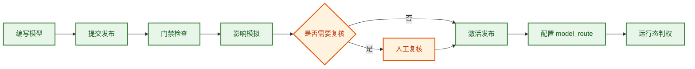
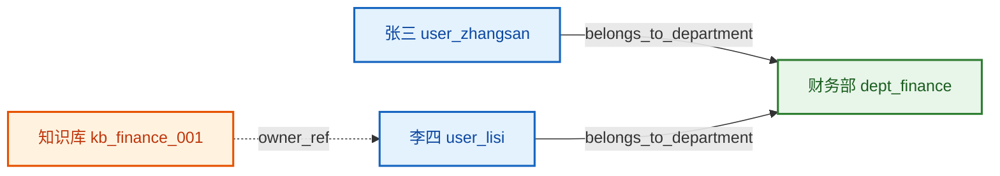
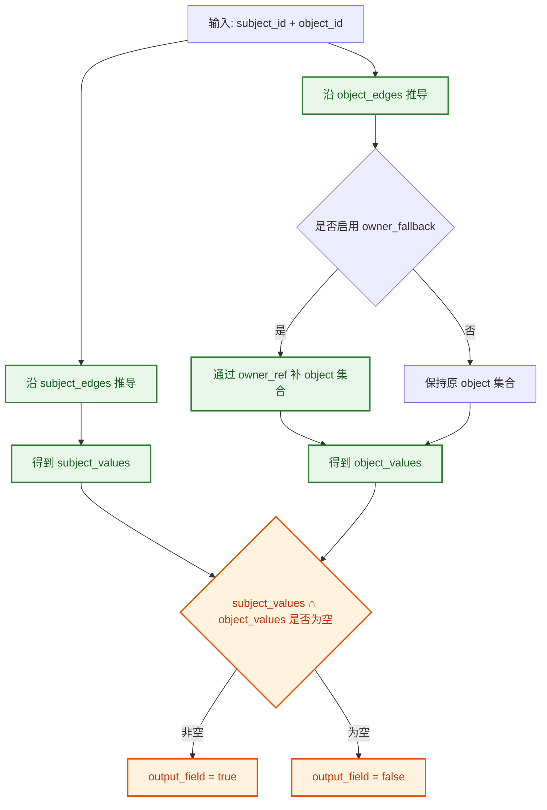

# 企业ACL建模与配置指南

> 文档编号：15  
> 更新日期：2026-03-07  
> 面向对象：权限管理员、实施顾问、集成人员、产品经理、研发人员  
> 术语遵循 [00_术语统一规范](./00_术语统一规范.md)  
> 阅读顺序建议：先读 [10_企业可配置权限模型开发设计.md](./10_企业可配置权限模型开发设计.md) 的设计原则，再结合本文理解如何落模型与实例；页面操作步骤详见 [14_企业ACL用户操作手册.md](./14_企业ACL用户操作手册.md)

## 1. 文档定位

1. 这个系统为什么这样设计。  
2. 权限模型应该如何从业务需求写成配置。  
3. 实例数据（`instance`）应该如何添加、维护并和模型配合工作。

如果你已经会用控制台，但在以下场景里经常拿不准，就应该读本文档：

1. 不知道一个新业务域应该先建什么、后建什么。  
2. 不清楚规则该写在 `model` 里，还是关系该落在 `instance` 里。  
3. 不确定 `tenant`、`namespace`、`model_route`、`publish` 之间如何衔接。  
4. 不知道为什么模型看起来正确，但运行时结果不符合预期。

## 2. 系统为什么这样设计

### 2.1 为什么不是只做 RBAC

企业权限场景里，很多规则并不是“给某个角色一组固定权限”这么简单。

常见真实需求包括：

1. 同部门可见，但跨部门不可见。  
2. 项目组成员可读，项目负责人可写。  
3. 高敏感资产只有值班角色在窗口期内可操作。  
4. owner 可以管理自己名下对象。  
5. 某人离岗后，相关授权要自动收敛。

这些需求都依赖关系、上下文和生命周期，而不是单纯角色。因此系统采用的是“主体 + 客体 + 动作 + 关系 + 上下文 + 生命周期”的统一建模思路。

### 2.2 为什么区分 `model` 和 `instance`

这是系统最重要的设计边界之一。

- `model`：定义规则框架，回答“系统允许怎样判权”
- `instance`：提供运行事实，回答“当前真实世界里发生了什么”

可以这样理解：

1. `model` 决定“部门成员可读本部门知识库”这类规则。  
2. `instance` 决定“张三属于财务部”“`kb_finance_001` 属于财务知识库”“owner 是李四”这类事实。  
3. 只有规则和事实同时存在，系统才能得到正确结果。

例子：

- 如果你只写了“同部门成员可读”，但没有录入“张三属于财务部”，那么运行时仍然可能拒绝。  
- 如果你录入了很多关系，但没有模型规则承接这些关系，也不会自动得出允许结果。

### 2.3 为什么需要 `namespace`

`namespace` 是运行态隔离边界，用来避免不同业务域的数据互相污染。

但要特别注意：**`namespace` 不是 `tenant`。**

- `tenant`：租户边界，表示模型和数据最终归属哪个租户
- `namespace`：运行态工作区，表示这个租户下哪一组对象、关系和路由放在一起维护

一个 `namespace` 下通常维护：

1. 客体台账。  
2. 关系事件。  
3. 模型路由。  
4. 审计记录。

这也意味着，在控制台信息架构上，`namespace` 更适合作为**运行态维护入口**出现，而不是作为模型定义区的第一筛选条件。

建议把不同业务域或不同系统拆到不同 `namespace`，例如：

1. `tenant_a.crm` 维护 CRM 相关权限事实。  
2. `tenant_a.kb` 维护知识库相关权限事实。  
3. `tenant_a.workflow` 维护流程审批相关权限事实。

更准确地说，上面的例子表示：

1. 同一个 `tenant_a` 租户下，可以有多个 `namespace`。  
2. 每个 `namespace` 可以路由到该租户下某个已发布模型。  
3. `namespace` 用来隔离运行事实，`tenant` 用来约束归属和模型一致性。

### 2.4 为什么还要显式谈 `tenant`

`tenant` 在系统里不是可有可无的标签，而是模型归属和路由校验的重要字段。

例如：

1. `model_meta.tenant_id` 明确模型属于哪个租户。  
2. `model_route.tenant_id` 要与已发布模型快照中的 `tenant_id` 一致。  
3. 一个租户通常会有多个模型版本、多个业务域，也就常常对应多个 `namespace`。

简单理解：

> `tenant` 回答“这套权限归谁”，`namespace` 回答“这些运行事实放在哪个工作区里”。

### 2.5 为什么要有 `model_route`

系统允许一个 `namespace` 把运行态请求路由到某个已发布模型。

`model_route` 的意义是：

1. 明确“这个运行域现在到底用哪一个模型版本判权”。  
2. 让发布后的模型能够被运行态查询、回放、搜索复用。  
3. 避免直接把“草稿模型”拿去跑正式流量。

简单理解时，可以连着看三层：

1. `publish` 解决的是“模型能不能上线”。  
2. `model_route` 解决的是“某个 `tenant` 下的某个 `namespace` 当前用哪一个已发布模型”。
3. `namespace` 解决的是“运行事实放在哪个工作区里供这次判权使用”。

### 2.6 为什么发布要经过门禁、模拟、复核、激活

因为权限模型一旦生效，影响的是整个业务访问面，不能像普通配置一样直接覆盖。

推荐链路是：



这条链路的核心目标是：

1. 不让明显错误的模型直接进入正式运行。  
2. 在上线前看到真实影响面。  
3. 对高风险变更保留人工治理环节。  
4. 保证正式运行只使用已发布模型。

## 3. 先建立正确的建模心智

建模时最容易犯的错，是一上来就写规则。实际上更好的顺序是：

1. 先识别租户和业务域边界。  
2. 再识别业务里的 `subject`、`object`、`action`。  
3. 再识别它们之间的 `relation`。  
4. 再判断哪些条件应该进 `context`。  
5. 最后才写 `policy rule`。

### 3.1 先识别 `tenant` 与 `namespace`

建模前先明确两件事：

1. 这套模型属于哪个 `tenant`。  
2. 这个租户下需要拆几个 `namespace`。

推荐判断方法：

1. 如果是不同租户的独立权限体系，先拆 `tenant`。  
2. 如果是同一租户下不同业务域、不同系统、不同运行面，优先拆 `namespace`。  
3. 一个 `tenant` 下允许存在多个 `namespace`，但一个 `namespace` 不应混入多个租户的数据。

例子：

- `tenant_techcorp` 是租户；其下可以拆 `tenant_techcorp.crm`、`tenant_techcorp.kb`、`tenant_techcorp.workflow`。  
- 这些 `namespace` 都仍然归属于同一个 `tenant_techcorp`。

### 3.2 先识别 `subject`

问自己：谁在发起动作？

常见 `subject` 包括：

1. 人：员工、外包、合作方成员。  
2. 组织：部门、项目组、虚拟协作组。  
3. 职责：岗位、审批角色、值班角色。  
4. 机器：服务账号、自动任务。

例子：

- “部门管理员可以维护本部门知识库”里，部门管理员是 `subject`。  
- “值班机器人可以触发升级流程”里，机器人账号是 `subject`。

### 3.3 再识别 `object`

问自己：动作作用在什么目标上？

常见 `object` 包括：

1. 知识库。  
2. 文档空间。  
3. 工单。  
4. 审批单。  
5. 服务、流程、项目空间。

例子：

- “查看财务知识库”中的知识库是 `object`。  
- “审批发布单”中的发布单是 `object`。

### 3.4 再识别 `action`

问自己：业务上到底在操作什么？

建议动作命名尽量业务稳定、粒度适中，常见有：

1. `read`  
2. `write`  
3. `approve`  
4. `grant`  
5. `publish`

避免把动作设计得过粗或过细：

1. 过粗会让不同风险动作被混成一个动作。  
2. 过细会让模型和治理复杂度急剧上升。

### 3.5 再识别 `relation`

问自己：权限是靠什么关系成立的？

常见关系包括：

1. `belongs_to_department`：属于某部门。  
2. `member_of`：属于某项目组。  
3. `manages`：管理某主体。  
4. `owned_by`：某客体归属某主体或某组织。  
5. `is_department_admin`：是某部门管理员。

例子：

- “同部门可读”依赖的是部门归属关系。  
- “owner 可写”依赖的是归属关系或 `owner_ref`。

### 3.6 最后识别 `context`

问自己：这条规则是否只在特定条件下成立？

适合进 `context` 的内容通常是：

1. 时间窗口。  
2. 运行环境。  
3. 风险等级。  
4. 请求来源。  
5. 由控制面推导出的上下文事实。

例子：

- “仅发布窗口允许审批”里的窗口期属于 `context`。  
- “同部门”如果不是直接写成关系，也可以通过 `context_inference` 推导出 `same_department_with_owner == true`。

## 4. 权限模型如何写

### 4.1 顶层结构怎么理解

当前模型结构的核心块通常包括：

1. `model_meta`：模型身份与版本信息。  
2. `catalogs`：动作、主体类型、客体类型、关系类型目录。  
3. `action_signature`：限定哪些主体类型可以对哪些客体类型发起哪些动作。  
4. `relation_signature`：限定关系类型允许连接哪些类型。  
5. `object_onboarding`：客体入管要求。  
6. `policies`：真正的授权规则。  
7. `constraints`：SoD、基数等治理约束。  
8. `lifecycle`：生命周期事件规则。  
9. `consistency`：一致性要求。  
10. `quality_guardrails`：质量和义务底线。  
11. `context_inference`：可选，用于把关系事实推导成上下文字段。

其中最常直接参与建模的是：

1. `catalogs`  
2. `action_signature`  
3. `relation_signature`  
4. `policies`  
5. `context_inference`

### 4.2 推荐的建模步骤

建议按下面顺序写模型：

1. 先写 `model_meta`。  
2. 再列出 `catalogs`。  
3. 再补 `action_signature` 与 `relation_signature`。  
4. 再写 `policies.rules`。  
5. 需要时再加 `context_inference`、`constraints`、`lifecycle`。  
6. 最后做模拟和回放验证。

这样做的好处是：

1. 类型边界清晰。  
2. 规则不容易引用不存在的动作和关系。  
3. 发布前更容易发现配置缺口。

### 4.3 一个最小可读的模型骨架

下面是一个适合入门理解的骨架示例：

```json
{
  "model_meta": {
    "model_id": "tenant_techcorp_department_kb_permissions",
    "tenant_id": "tenant_techcorp",
    "version": "2026.03.07",
    "status": "draft",
    "combining_algorithm": "deny-overrides"
  },
  "catalogs": {
    "action_catalog": ["read", "write"],
    "subject_type_catalog": ["user", "department"],
    "object_type_catalog": ["kb"],
    "subject_relation_type_catalog": ["belongs_to_department", "is_department_admin"],
    "object_relation_type_catalog": [],
    "subject_object_relation_type_catalog": []
  },
  "action_signature": {
    "tuples": [
      {
        "subject_types": ["user"],
        "object_types": ["kb"],
        "actions": ["read", "write"]
      }
    ]
  },
  "relation_signature": {
    "subject_relations": [
      {
        "relation_type": "belongs_to_department",
        "from_types": ["user"],
        "to_types": ["department"]
      },
      {
        "relation_type": "is_department_admin",
        "from_types": ["user"],
        "to_types": ["department"]
      }
    ],
    "object_relations": [],
    "subject_object_relations": []
  },
  "object_onboarding": {
    "compatibility_mode": "compat_balanced",
    "default_profile": "minimal",
    "profiles": {
      "minimal": {
        "required_fields": ["tenant_id", "object_id", "object_type", "created_by"],
        "autofill": {
          "owner_ref": "created_by",
          "sensitivity": "normal"
        }
      }
    },
    "conditional_required": []
  },
  "policies": {
    "rules": [
      {
        "id": "same_department_member_can_read",
        "subject_selector": "subject.type == user and context.same_department_with_owner == true",
        "object_selector": "object.type == kb",
        "action_set": ["read"],
        "effect": "allow",
        "priority": 100
      }
    ]
  },
  "constraints": {
    "sod_rules": [],
    "cardinality_rules": []
  },
  "lifecycle": {
    "event_rules": []
  },
  "consistency": {
    "default_level": "bounded_staleness",
    "high_risk_level": "strong",
    "bounded_staleness_ms": 3000
  },
  "quality_guardrails": {
    "attribute_quality": {
      "authority_whitelist": ["hr_system", "org_system"],
      "freshness_ttl_sec": {},
      "reject_unknown_source": true
    },
    "mandatory_obligations": []
  }
}
```

这个骨架适合表达的业务意思是：

> 用户对知识库的 `read` 权限，取决于是否与该知识库 owner 同部门。

### 4.4 规则要怎么写才稳定

每条规则通常都要回答 5 个问题：

1. 哪些主体适用。  
2. 哪些客体适用。  
3. 哪些动作适用。  
4. 结果是 `allow` 还是 `deny`。  
5. 与其他规则冲突时谁优先。

规则最常用的字段是：

| 字段 | 含义 | 建模建议 |
| --- | --- | --- |
| `id` | 规则标识 | 语义清晰、可追踪 |
| `subject_selector` | 主体选择条件 | 先写清主体范围 |
| `object_selector` | 客体选择条件 | 再写客体范围 |
| `action_set` | 动作集合 | 同风险动作尽量归并 |
| `effect` | `allow` / `deny` | 高风险条件优先显式 `deny` |
| `priority` | 优先级 | 留出层级，避免全部写成相同优先级 |
| `conditions` | 额外条件 | 只在确有必要时使用 |

### 4.5 三个常见建模模式

#### 模式 A：同部门可读

业务语义：用户和知识库 owner 同部门时，可以读取知识库。

推荐做法：

1. 维护“用户属于部门”的关系。  
2. 维护知识库的 `owner_ref`。  
3. 用 `context_inference` 推导出 `same_department_with_owner`。  
4. 在规则中使用该上下文字段。

#### 模式 B：部门管理员可写

业务语义：部门管理员不仅能读，还能维护本部门知识库。

推荐做法：

1. 维护 `is_department_admin` 这类主体关系。  
2. 通过上下文推导识别其是否为目标客体 owner 所在部门的管理员。  
3. 单独写一条优先级更高的 `write` 规则。

#### 模式 C：高敏感资产只允许值班窗口操作

业务语义：高敏感对象只有在值班窗口内才能执行关键动作。

推荐做法：

1. 把高敏感性放在 `object.sensitivity`。  
2. 把值班窗口放在 `context`。  
3. 用 `allow + conditions` 或高优先级 `deny` 保护窗口外访问。

### 4.6 `context_inference` 怎么理解

这是整套模型里最容易让人觉得抽象的一块，但如果你抓住下面这句话，其实就不难了：

> `context_inference` 不是直接给权限，而是**先从关系图里推导出一个布尔上下文字段**，再让策略规则使用这个字段。

例如规则里写：

```json
{
  "id": "same_department_member_can_read",
  "subject_selector": "subject.type == user and context.same_department_with_owner == true",
  "object_selector": "object.type == kb",
  "action_set": ["read"],
  "effect": "allow",
  "priority": 100
}
```

这条规则本身**不会**去图里找部门关系，它只会问一句：

- `context.same_department_with_owner` 现在是不是 `true`？

而这句布尔值，就是 `context_inference` 提前算出来的。

#### 4.6.1 它本质上在做什么

每条 `context_inference` 规则，做的事情可以概括为 4 步：

1. 从 `subject` 出发，沿着 `subject_edges` 走一遍图，得到一个集合。  
2. 从 `object` 出发，沿着 `object_edges` 走一遍图，得到另一个集合。  
3. 如果启用了 `object_owner_fallback`，再通过 `owner_ref` 把 object 侧集合补全。  
4. 比较两个集合是否有交集：**交集非空则 `true`，交集为空则 `false`**。

注意，不是简单看某一边集合是否为空，而是看：

> `subject_values ∩ object_values` 是否为空。

#### 4.6.2 先看一张图：同部门可读

下面这张图对应一个典型场景：张三想读取某个知识库；系统要判断“张三是否与该知识库 owner 同部门”。



如果把这张图翻译成推导过程，就是：

1. 从 `subject = user_zhangsan` 出发，沿 `belongs_to_department` 走一步，得到 `{dept_finance}`。  
2. 从 `object = kb_finance_001` 出发，如果直接关系不够，就通过 `owner_ref` 找到 `user_lisi`。  
3. 再从 `user_lisi` 沿 `belongs_to_department` 走一步，也得到 `{dept_finance}`。  
4. 两边交集为 `{dept_finance}`，非空，因此 `same_department_with_owner = true`。

#### 4.6.3 对应配置怎么写

这类推导在当前样例模型里通常会写成：

```json
{
  "id": "infer_same_department_with_owner",
  "output_field": "same_department_with_owner",
  "subject_edges": [
    {
      "relation_type": "belongs_to_department",
      "entity_side": "from"
    }
  ],
  "object_edges": [
    {
      "relation_type": "owned_by",
      "entity_side": "from"
    },
    {
      "relation_type": "belongs_to_department",
      "entity_side": "from"
    }
  ],
  "object_owner_fallback": true,
  "owner_fallback_include_input": true
}
```

字段可以这样理解：

1. `output_field`：推导结果最终写到哪个 `context.xxx` 字段。  
2. `subject_edges`：从主体出发，按什么关系路径去找目标集合。  
3. `object_edges`：从客体出发，按什么关系路径去找目标集合。  
4. `object_owner_fallback`：如果 object 侧路径不够，是否允许通过 `owner_ref` 补做一次推导。  
5. `owner_fallback_include_input`：是否把“输入 object 自己的 owner_ref”也纳入 fallback。

#### 4.6.4 `entity_side` 到底是什么意思

这是第二个容易绕的点。

系统里每条关系边都有 `from` 和 `to`。`entity_side` 的意思是：

1. 如果写 `from`，表示“当前节点放在关系的 `from` 端去查”。  
2. 如果写 `to`，表示“当前节点放在关系的 `to` 端去查”。

然后系统会返回这条边的“另一端”作为下一跳。

举例：

- 关系边是 `user_zhangsan --belongs_to_department--> dept_finance`  
- 当前节点是 `user_zhangsan`  
- 如果 `entity_side = from`，就能匹配到这条边，并把 `dept_finance` 作为下一跳结果

所以：

> `entity_side` 不是“返回哪一边”，而是“当前节点应该匹配关系边的哪一边”。

#### 4.6.5 最关键的一步：为什么最后看“集合是否有交集”

因为这类规则的本质，不是要找一条固定的唯一路径，而是要判断：

- 主体这一侧最终落到了哪些标签/组织/目标集合
- 客体这一侧最终落到了哪些标签/组织/目标集合
- 两边有没有落到同一个集合成员上

可以把算法理解成下面这样：



对应到“同部门可读”的例子：

- `subject_values = {dept_finance}`
- `object_values = {dept_finance}`
- 交集 = `{dept_finance}`
- 因此 `same_department_with_owner = true`

如果客体 owner 属于法务部，那么：

- `subject_values = {dept_finance}`
- `object_values = {dept_legal}`
- 交集 = `∅`
- 因此 `same_department_with_owner = false`

#### 4.6.6 再看一个例子：部门管理员是否管理 owner 所在部门

另一个常见场景是：

> 某用户是否是“目标客体 owner 所在部门”的管理员。

对应推导思路是：

1. 主体侧，不再沿 `belongs_to_department` 走，而是沿 `is_department_admin` 走，得到“他管理哪些部门”的集合。  
2. 客体侧，仍然通过 owner 找到 owner 所在部门的集合。  
3. 比较这两个集合是否有交集。

如果：

- 张三管理 `{dept_finance}`
- 知识库 owner 所在部门也是 `{dept_finance}`

那么：

- `is_department_admin_of_owner = true`

然后策略规则就可以写：

```json
{
  "id": "department_admin_can_read_write_department_kb",
  "subject_selector": "subject.type == user and context.is_department_admin_of_owner == true",
  "object_selector": "object.type == kb",
  "action_set": ["read", "write"],
  "effect": "allow",
  "priority": 150
}
```

#### 4.6.7 建模时最容易踩的坑

1. **把 `context_inference` 当成授权规则本身**：它只负责算布尔上下文，不直接 `allow/deny`。  
2. **只看一边集合，不看交集**：真正决定结果的是交集是否为空。  
3. **忘了维护 owner 或关系事实**：推导规则写得再对，没有 `owner_ref` 或部门关系也推不出来。  
4. **`entity_side` 写反**：会导致整条路径查不到结果。  
5. **把复杂业务全塞进推导层**：推导层适合产出结构清晰的布尔事实，不适合承担全部授权逻辑。

## 5. 实例如何添加

### 5.1 什么是 `instance`

在本文语境中，`instance` 指运行态事实数据，主要包括：

1. `objects`：客体台账。  
2. `relation_events`：关系事件。  
3. `model_routes`：模型路由。

这些数据不会替代模型，而是给模型提供运行时输入。

### 5.2 先加什么，后加什么

建议顺序如下：

1. 先确定 `tenant` 与 `namespace`。  
2. 再维护 `objects`。  
3. 再补 `relation_events`。  
4. 模型发布后再配置 `model_routes`。  
5. 最后通过模拟、回放或搜索验证。

从页面设计心智上，也建议对应成：

1. 模型区先关注 `tenant_id`、模型版本、规则内容。  
2. 运行态区再选择 `namespace` 并维护 `instance`。  
3. 不要让使用者误以为“模型一创建就天然绑定某个 `namespace`”。

这样可以减少“路由已配好，但运行事实还没准备完”的空跑问题。

### 5.3 `objects` 怎么加

最常见的客体字段包括：

1. `object_id`：客体唯一标识。  
2. `object_type`：客体类型。  
3. `sensitivity`：敏感级别。  
4. `owner_ref`：owner 引用。  
5. `labels`：补充标签。

例子：

```json
{
  "object_id": "kb_finance_001",
  "object_type": "kb",
  "sensitivity": "high",
  "owner_ref": "user_lisi",
  "labels": ["finance", "internal"]
}
```

使用建议：

1. `object_id` 必须稳定，不要用会频繁变化的展示名。  
2. 能明确 owner 的对象尽量补 `owner_ref`。  
3. `labels` 适合承载筛选和补充语义，不适合代替核心关系。

### 5.4 `relation_events` 怎么加

关系事件最常见的字段包括：

1. `from`  
2. `to`  
3. `relation_type`  
4. `operation`：`upsert` 或 `delete`  
5. `scope`：可选  
6. `source`：可选

例子：

```json
{
  "from": "user_zhangsan",
  "to": "dept_finance",
  "relation_type": "belongs_to_department",
  "operation": "upsert",
  "source": "org_sync"
}
```

使用建议：

1. 关系命名要与 `relation_signature` 保持一致。  
2. 如果关系有来源系统，建议补 `source`。  
3. 删除关系时不要直接改模型，应该发一条 `delete` 事件或同步删除。

### 5.5 `model_routes` 怎么加

`model_route` 用来把某个 `tenant` 下的某个 `namespace` 指向一个已发布模型。

这里要特别注意一个容易混淆的点：`namespace` **一定参与 `model_route` 的写入**，只是它不一定写在每一条 `model_routes[]` 记录内部。

当前系统里有两种常见写法：

1. **API 写法**：`namespace` 作为请求顶层字段，`routes[]` 里写 `tenant_id/environment/model_id/...`。  
2. **Instance JSON 写法**：顶层 `namespace` 作为默认工作区；`model_routes[]` 里的每条记录可以不写 `namespace`，默认继承顶层值；如果需要批量写入多个命名空间，也可以在单条 route 上显式写 `namespace` 覆盖。

常见字段包括：

1. `namespace`：路由所属工作区，常见于请求顶层，必要时也可出现在单条 route 上。  
2. `tenant_id`  
3. `environment`  
4. `model_id`  
5. `model_version` 或 `publish_id`  
6. `operator`

API 请求示意：

```json
{
  "namespace": "tenant_techcorp.kb",
  "routes": [
    {
      "tenant_id": "tenant_techcorp",
      "environment": "prod",
      "model_id": "tenant_techcorp_department_kb_permissions",
      "model_version": "2026.03.07",
      "publish_id": "pub_20260307_001",
      "operator": "console_operator"
    }
  ]
}
```

单条 route 记录示意：

```json
{
  "tenant_id": "tenant_techcorp",
  "environment": "prod",
  "model_id": "tenant_techcorp_department_kb_permissions",
  "model_version": "2026.03.07",
  "publish_id": "pub_20260307_001",
  "operator": "console_operator"
}
```

使用建议：

1. 只把 `published` 的模型挂到 `model_route`。  
2. `namespace` 决定这条路由落在哪个运行态工作区，不能省略语义，只是可以由顶层继承。  
3. `tenant_id`、`model_id`、`model_version` 必须和已发布快照一致。  
4. 正式环境尽量通过发布流程产出 `publish_id` 后再路由。

### 5.6 控制台里的 `Instance JSON` 推荐写法

控制台当前支持的 `Instance JSON` 主要字段是：`namespace`、`objects`、`relation_events`，以及可选的 `model_routes`。

其中：

1. 顶层 `namespace` 是默认工作区。  
2. `objects` 和 `relation_events` 默认写入这个 `namespace`。  
3. `model_routes[]` 里的每一条也默认继承这个 `namespace`。  
4. 如果某条 `model_route` 需要落到另一个工作区，可以在该条记录上单独写 `namespace` 覆盖。

推荐示例：

```json
{
  "namespace": "tenant_techcorp.kb",
  "objects": [
    {
      "object_id": "kb_finance_001",
      "object_type": "kb",
      "sensitivity": "high",
      "owner_ref": "user_lisi",
      "labels": ["finance", "internal"]
    }
  ],
  "relation_events": [
    {
      "from": "user_zhangsan",
      "to": "dept_finance",
      "relation_type": "belongs_to_department",
      "operation": "upsert",
      "source": "org_sync"
    },
    {
      "from": "user_lisi",
      "to": "dept_finance",
      "relation_type": "is_department_admin",
      "operation": "upsert",
      "source": "manual"
    }
  ],
  "model_routes": [
    {
      "namespace": "tenant_techcorp.kb",
      "tenant_id": "tenant_techcorp",
      "environment": "prod",
      "model_id": "tenant_techcorp_department_kb_permissions",
      "model_version": "2026.03.07",
      "publish_id": "pub_20260307_001",
      "operator": "console_operator"
    }
  ]
}
```

这段 JSON 的业务意思是：

1. 在 `tenant_techcorp.kb` 这个命名空间下维护知识库权限事实。  
2. 录入一个高敏感知识库对象。  
3. 录入张三属于财务部、李四是财务部管理员的关系。  
4. 把这个命名空间路由到一个已发布的知识库权限模型。

## 6. 一个从需求到配置的完整例子

假设需求如下：

1. 财务部成员可以读取本部门知识库。  
2. 财务部管理员可以读写本部门知识库。  
3. 高敏感知识库的关键变更必须走发布流程治理。

推荐落地步骤：

### 6.1 先抽象对象

1. `subject`：`user`、`department`  
2. `object`：`kb`  
3. `action`：`read`、`write`

### 6.2 再抽象关系

1. `belongs_to_department`  
2. `is_department_admin`  
3. `owner_ref` 或 `owned_by`

### 6.3 再写规则

1. 同部门成员可 `read`。  
2. 部门管理员可 `read`、`write`。  
3. 需要时对高敏感对象补显式保护规则。

### 6.4 再录入实例

1. 录入知识库对象。  
2. 录入员工与部门的关系。  
3. 录入管理员关系。  
4. 配置正式环境的 `model_route`。

### 6.5 最后做验证

1. 提交发布。  
2. 看影响模拟。  
3. 激活后做决策回放。  
4. 如有争议，再去关系回放核对关系链。

## 7. 常见错误与修正建议

### 7.1 只写规则，不补事实

现象：规则看起来正确，但运行时仍然拒绝。

常见原因：

1. `object` 没录入。  
2. `owner_ref` 缺失。  
3. `relation_events` 没同步。  
4. `namespace` 用错。

### 7.2 动作和类型目录没对齐

现象：规则写了，但门禁或校验报错。

常见原因：

1. `action_set` 里引用了未注册动作。  
2. `subject_selector` 或 `object_selector` 使用了目录外类型。  
3. 关系名与 `relation_signature` 不一致。

### 7.3 把运行事实写进模型

现象：模型越来越大，但仍然难维护。

修正建议：

1. 规则留在 `model`。  
2. 对象、关系、路由放进 `instance`。  
3. 不要把“张三属于财务部”这种事实直接写死在模型规则里。

### 7.4 先路由，后发布

现象：`model_route` 已配置，但运行时找不到可用模型。

修正建议：

1. 先完成 `publish`。  
2. 确认状态为 `published`。  
3. 再配置 `model_route`。

## 8. 与操作手册如何配合阅读

建议这样使用两份文档：

1. 想知道页面怎么点，读 [14_企业ACL用户操作手册.md](./14_企业ACL用户操作手册.md)。  
2. 想知道模型怎么写、实例怎么配，读本文。  
3. 想追根到底层设计，读 [10_企业可配置权限模型开发设计.md](./10_企业可配置权限模型开发设计.md)。  
4. 想核对字段结构与校验口径，读 [11_权限配置JSON_Schema草案.md](./11_权限配置JSON_Schema草案.md)。  
5. 想理解发布门禁和阈值，读 [12_权限发布门禁规则样例.md](./12_权限发布门禁规则样例.md)。

一句话总结：

> `14` 解决“怎么操作”，`15` 解决“怎么配置”，`10/11/12` 解决“为什么这样设计，以及底层规则是什么”。
